author: Votre Nom
summary: Atelier GitHub Copilot
id: github-copilot-workshop
categories: IA, Développement
environments: Web
status: Publié
feedback link: https://example.com/feedback

# Atelier GitHub Copilot

## À propos de l'atelier
Duration: 5

Bienvenue à l'Atelier GitHub Copilot ! Dans cet atelier, vous apprendrez à utiliser GitHub Copilot pour expliquer et améliorer le code.
GitHub Copilot Chat permet un dialogue interactif avec l'IA à travers une expérience de chat. Apprenons à utiliser GitHub Copilot à travers cet atelier !


### Objectifs du jour
- Comprendre les différentes fonctionnalités de GitHub Copilot
- Développer une nouvelle application en utilisant le mode agent

### Prérequis
- Visual Studio Code est installé
- Une licence GitHub Copilot est disponible
- Un compte GitHub est disponible

## Configuration du projet
Duration: 15

Cet atelier utilise le dépôt GitHub suivant :

**URL du projet** : https://github.com/moulongzhang/2025-Github-Copilot-Workshop-Python

### Étape 1 : Forker le dépôt

Tout d'abord, ouvrez l'URL du projet ci-dessus dans votre navigateur et forkez le dépôt :

1. Ouvrez l'URL du projet (https://github.com/moulongzhang/2025-Github-Copilot-Workshop-Python) dans votre navigateur
2. Cliquez sur le bouton **Fork** en haut à droite

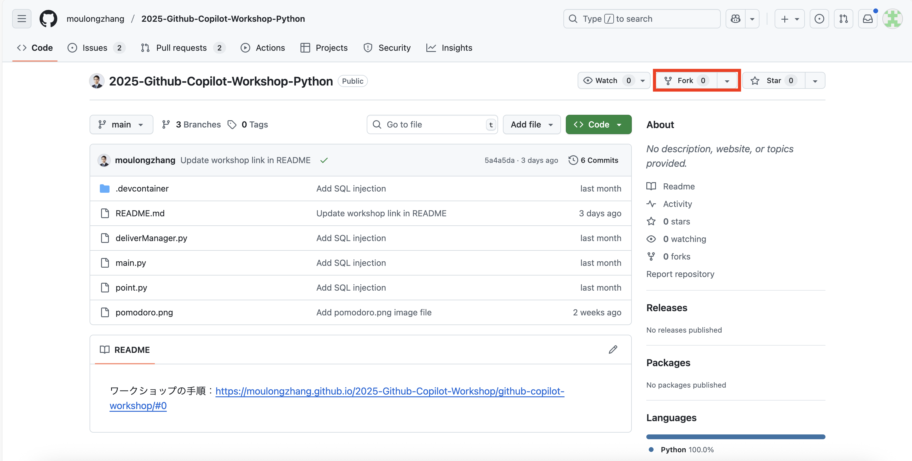

3. Cliquez sur le bouton **Create fork** sur l'écran de création du fork


Une fois le fork terminé, une copie du dépôt sera créée dans votre compte GitHub.

### Étape 2 : Configuration de l'environnement de développement

En utilisant votre dépôt forké, vous pouvez démarrer le projet en utilisant l'une des méthodes suivantes :

#### Méthode A : Utiliser GitHub Codespaces (Recommandé)

1. Sur la page de votre dépôt forké (`https://github.com/[votre-nom-utilisateur]/2025-Github-Copilot-Workshop-Python`)
2. Cliquez sur le bouton vert **Code**
3. Sélectionnez l'onglet **Codespaces**
4. Cliquez sur **Create codespace on main**


> aside positive
>
> **Astuce** : L'utilisation de Codespaces lance un environnement de type VS Code dans votre navigateur, vous permettant de commencer le développement immédiatement.


#### Méthode B : Cloner dans l'environnement local

Si vous avez VS Code installé localement :

1. Ouvrez le Terminal ou l'Invite de commandes
2. Clonez votre dépôt forké avec la commande suivante :

```bash
git clone https://github.com/[votre-nom-utilisateur]/2025-Github-Copilot-Workshop-Python.git
```

3. Naviguez vers le répertoire cloné :

```bash
cd 2025-Github-Copilot-Workshop-Python
```

4. Ouvrez le projet dans VS Code :

```bash
code .
```

### Étape 3 : Installer les extensions requises

Après avoir ouvert le projet, veuillez installer les extensions suivantes :

1. Installer l'extension **GitHub Copilot**
2. Installer l'extension **GitHub Copilot Chat**
3. Installer l'extension **Python**

### Étape 4 : Vérification de la configuration

1. Confirmez que vous êtes connecté à votre compte GitHub dans VS Code
2. Confirmez que la fonctionnalité Copilot est activée
3. Confirmez que l'interpréteur Python est correctement configuré

## Essayer la complétion de code
Duration: 10

Découvrons la fonctionnalité de base de complétion de code de GitHub Copilot.

### Installer les extensions Copilot

1. Installer l'extension **GitHub Copilot**
2. Installer l'extension **GitHub Copilot Chat**

### Vérification de la configuration
Assurez-vous que vous êtes connecté à VS Code.

### Essayer la complétion de code

Créez un nouveau fichier Python et entrez le commentaire suivant :

```python
# Fonction pour calculer la suite de Fibonacci
def fibonacci(n):
```

Vérifiez que Copilot suggère automatiquement du code.

> aside positive
>
> **Astuce** : Utilisez la touche `Tab` pour accepter les suggestions et `Alt+]` pour voir la suggestion suivante.

## Instructions de configuration des suggestions d'édition suivantes de GitHub Copilot
Duration: 10

### Vue d'ensemble
⚙️ [`github.copilot.nextEditSuggestions.enabled`](vscode://settings/github.copilot.nextEditSuggestions.enabled) est un paramètre qui active la fonctionnalité de suggestion d'édition de nouvelle génération de GitHub Copilot. Cette fonctionnalité vous permet de recevoir des suggestions d'édition de code plus avancées.

### 1. Ouvrir VS Code

### 2. Accéder aux paramètres
Ouvrez l'écran des paramètres en utilisant l'une des méthodes suivantes :

#### Méthode A : Depuis le menu
- **Windows/Linux** : `File` → `Preferences` → `Settings`
- **macOS** : `Code` → `Settings...` → `Settings`

#### Méthode B : Raccourci clavier
- **Windows/Linux** : `Ctrl + ,`
- **macOS** : `Cmd + ,`

#### Méthode C : Palette de commandes
- `Ctrl + Shift + P` (Windows/Linux) ou `Cmd + Shift + P` (macOS)
- Sélectionnez `Preferences: Open Settings (UI)`

### 3. Rechercher les paramètres
Entrez ce qui suit dans la boîte de recherche des paramètres :
```
github.copilot.nextEditSuggestions.enabled
```

### 4. Activer le paramètre
- Cochez la case pour l'élément de paramètre affiché dans les résultats de recherche
- Ou changez `false` en `true`

### 5. Confirmer le paramètre
Vérifiez que le paramètre est correctement appliqué :
- Redémarrez VS Code (recommandé)
- Éditez du code dans l'éditeur et confirmez que la nouvelle fonctionnalité de suggestion fonctionne

### Méthode alternative : Édition directe dans settings.json

#### 1. Ouvrir le fichier settings.json
- `Ctrl + Shift + P` (Windows/Linux) ou `Cmd + Shift + P` (macOS)
- Sélectionnez `Preferences: Open User Settings (JSON)`

#### 2. Ajouter le paramètre
```json
{
    "github.copilot.nextEditSuggestions.enabled": true
}
```

#### 3. Enregistrer le fichier
- `Ctrl + S` (Windows/Linux) ou `Cmd + S` (macOS)

### Essayons-le

Ouvrez le fichier `point.py` inclus dans le projet. Ce fichier contient une classe représentant des points dans l'espace à deux dimensions. Copiez l'extrait de code ci-dessous dans le fichier `point.py`.

```python
import math

class Point2D:
    def __init__(self, x, y):
        self.x = x
        self.y = y
    
    def distance_to(self, other):
        dx = self.x - other.x
        dy = self.y - other.y
        return math.sqrt(dx * dx + dy * dy)
    
    def __str__(self):
        return f"Point2D({self.x}, {self.y})"
```

Maintenant, nous voulons étendre cette classe pour représenter des points dans l'espace à trois dimensions. Tout d'abord, changeons manuellement le nom de la classe en `Point3D`. GitHub Copilot suggérera ensuite les prochains candidats d'édition.

> aside positive
>
> **Important** : Il peut falloir un certain temps pour que les propositions de suggestion d'édition suivante apparaissent. Veuillez patienter.

Les suggestions devraient afficher des changements comme :
- Ajout du paramètre `z` à la méthode `__init__`
- Ajout de `self.z = z`
- Extension de la méthode `distance_to` pour le calcul de distance en trois dimensions
- Affichage de la coordonnée z dans la méthode `__str__`

Dans cet état, appuyer sur la touche `Tab` déplacera le curseur à l'emplacement où GitHub Copilot fait des suggestions. Pour accepter la suggestion, appuyez à nouveau sur la touche `Tab`.

GitHub Copilot devrait ensuite suggérer le prochain candidat d'édition. Cette suggestion peut également être acceptée en appuyant sur la touche `Tab`. L'utilisation de la suggestion d'édition suivante vous permet d'éditer le code efficacement.

### Voyons les résultats

Continuons à étendre la classe Point2D en Point3D. Vous devriez pouvoir adapter toutes les méthodes pour l'espace à trois dimensions.

Exemple de code final attendu :

```python
import math

class Point3D:
    def __init__(self, x, y, z):
        self.x = x
        self.y = y
        self.z = z
    
    def distance_to(self, other):
        dx = self.x - other.x
        dy = self.y - other.y
        dz = self.z - other.z
        return math.sqrt(dx * dx + dy * dy + dz * dz)
    
    def __str__(self):
        return f"Point3D({self.x}, {self.y}, {self.z})"
```

### Essayons aussi avec les commentaires TODO

Remplacez `2D` (deux dimensions) par `3D` (trois dimensions) dans la première ligne commentée.

```python
# Classe représentant des points dans l'espace à trois dimensions
class Point2D:
    def __init__(self, x, y):
        self.x = x
        self.y = y
    
    def distance_to(self, other):
        # TODO: Ajouter le code de calcul de distance ici
        pass
    
    def __str__(self):
        # TODO: Retourner la représentation en chaîne
        pass
```

Placez le curseur après les commentaires TODO et vérifiez les suggestions de Copilot.

### Notes importantes

- Assurez-vous que l'extension GitHub Copilot de VS Code est mise à jour à la dernière version
- Le redémarrage de VS Code est recommandé après les changements de paramètres

### Dépannage

#### Si les paramètres ne sont pas trouvés
1. Confirmez que l'extension GitHub Copilot est installée
2. Confirmez que l'extension est mise à jour à la dernière version
3. Redémarrez VS Code et réessayez

#### Si la fonctionnalité ne fonctionne pas
1. Confirmez que vous êtes connecté à GitHub Copilot
2. Vérifiez la connexion Internet
3. Vérifiez les messages d'erreur dans la console VS Code

## Préparation pratique de Copilot Chat
Duration: 5

### Créer un fichier

Veuillez enregistrer le fichier suivant sous le nom `delivery_manager.py`.

```python
import time
import random
from typing import List, Callable, Optional
from dataclasses import dataclass, field
from enum import Enum


class Event:
    """Classe d'événement simple (équivalent des événements Unity)"""
    
    def __init__(self):
        self._handlers: List[Callable] = []
    
    def add_handler(self, handler: Callable):
        """Ajouter un gestionnaire d'événements"""
        if handler not in self._handlers:
            self._handlers.append(handler)
    
    def remove_handler(self, handler: Callable):
        """Supprimer un gestionnaire d'événements"""
        if handler in self._handlers:
            self._handlers.remove(handler)
    
    def invoke(self, sender, args=None):
        """Déclencher un événement"""
        for handler in self._handlers:
            handler(sender, args)


@dataclass
class KitchenObjectSO:
    """Classe de données d'objet de cuisine"""
    object_name: str
    object_id: int


@dataclass
class RecipeSO:
    """Classe de données de recette"""
    recipe_name: str
    kitchen_object_so_list: List[KitchenObjectSO]


@dataclass
class RecipeListSO:
    """Classe de données de liste de recettes"""
    recipe_so_list: List[RecipeSO] = field(default_factory=list)


class PlateKitchenObject:
    """Objet de cuisine assiette"""
    
    def __init__(self):
        self._kitchen_object_so_list: List[KitchenObjectSO] = []
    
    def add_kitchen_object(self, kitchen_object: KitchenObjectSO):
        """Ajouter un objet de cuisine"""
        self._kitchen_object_so_list.append(kitchen_object)
    
    def get_kitchen_object_so_list(self) -> List[KitchenObjectSO]:
        """Obtenir la liste des objets de cuisine"""
        return self._kitchen_object_so_list.copy()


class KitchenGameManager:
    """Gestionnaire de jeu de cuisine (Singleton)"""
    
    _instance: Optional['KitchenGameManager'] = None
    
    def __init__(self):
        self._is_game_playing = False
    
    @classmethod
    def get_instance(cls) -> 'KitchenGameManager':
        """Obtenir l'instance Singleton"""
        if cls._instance is None:
            cls._instance = cls()
        return cls._instance
    
    def is_game_playing(self) -> bool:
        """Vérifier si le jeu est en cours"""
        return self._is_game_playing
    
    def start_game(self):
        """Démarrer le jeu"""
        self._is_game_playing = True
    
    def stop_game(self):
        """Arrêter le jeu"""
        self._is_game_playing = False


class DeliveryManager:
    """Classe de gestion de livraison (version Python)"""
    
    _instance: Optional['DeliveryManager'] = None
    
    def __init__(self, recipe_list_so: RecipeListSO):
        # Définitions d'événements
        self.on_recipe_spawned = Event()
        self.on_recipe_completed = Event()
        self.on_recipe_success = Event()
        self.on_recipe_failed = Event()
        
        # Variables privées
        self._recipe_list_so = recipe_list_so
        self._waiting_recipe_so_list: List[RecipeSO] = []
        self._spawn_recipe_timer = 0.0
        self._spawn_recipe_timer_max = 4.0
        self._waiting_recipes_max = 4
        self._successful_recipes_amount = 0
        self._last_update_time = time.time()
    
    @classmethod
    def get_instance(cls, recipe_list_so: RecipeListSO = None) -> 'DeliveryManager':
        """Obtenir l'instance Singleton"""
        if cls._instance is None:
            if recipe_list_so is None:
                raise ValueError("recipe_list_so est requis pour la création initiale")
            cls._instance = cls(recipe_list_so)
        return cls._instance
    
    def update(self):
        """Traitement de mise à jour par image (équivalent à Update d'Unity)"""
        current_time = time.time()
        delta_time = current_time - self._last_update_time
        self._last_update_time = current_time
        
        self._spawn_recipe_timer -= delta_time
        
        if self._spawn_recipe_timer <= 0.0:
            self._spawn_recipe_timer = self._spawn_recipe_timer_max
            
            kitchen_game_manager = KitchenGameManager.get_instance()
            if (kitchen_game_manager.is_game_playing() and 
                len(self._waiting_recipe_so_list) < self._waiting_recipes_max):
                
                # Sélectionner une recette au hasard
                waiting_recipe_so = random.choice(self._recipe_list_so.recipe_so_list)
                self._waiting_recipe_so_list.append(waiting_recipe_so)
                
                # Déclencher l'événement
                self.on_recipe_spawned.invoke(self)
    
    def deliver_recipe(self, plate_kitchen_object: PlateKitchenObject):
        """Vérifier si les ingrédients de la recette correspondent aux ingrédients de l'assiette"""
        
        for i, waiting_recipe_so in enumerate(self._waiting_recipe_so_list):
            plate_ingredients = plate_kitchen_object.get_kitchen_object_so_list()
            
            # Vérifier si le nombre d'ingrédients correspond
            if len(waiting_recipe_so.kitchen_object_so_list) == len(plate_ingredients):
                plate_contents_matches_recipe = True
                
                # Vérifier chaque ingrédient de la recette
                for recipe_kitchen_object_so in waiting_recipe_so.kitchen_object_so_list:
                    ingredient_found = False
                    
                    # Correspondre avec les ingrédients de l'assiette
                    for plate_kitchen_object_so in plate_ingredients:
                        if plate_kitchen_object_so == recipe_kitchen_object_so:
                            ingredient_found = True
                            break
                    
                    if not ingredient_found:
                        plate_contents_matches_recipe = False
                        break
                
                # Si les ingrédients correspondent complètement
                if plate_contents_matches_recipe:
                    self._successful_recipes_amount += 1
                    self._waiting_recipe_so_list.pop(i)
                    
                    # Déclencher les événements de succès
                    self.on_recipe_completed.invoke(self)
                    self.on_recipe_success.invoke(self)
                    return
        
        # Si aucune recette correspondante n'est trouvée
        self.on_recipe_failed.invoke(self)
    
    def get_waiting_recipe_so_list(self) -> List[RecipeSO]:
        """Obtenir la liste des recettes en attente"""
        return self._waiting_recipe_so_list.copy()
    
    def get_successful_recipes_amount(self) -> int:
        """Obtenir le nombre de recettes réussies"""
        return self._successful_recipes_amount


# Exemple d'utilisation
if __name__ == "__main__":
    # Créer des données d'exemple
    tomato = KitchenObjectSO("Tomate", 1)
    lettuce = KitchenObjectSO("Laitue", 2)
    bread = KitchenObjectSO("Pain", 3)
    
    # Recettes d'exemple
    sandwich_recipe = RecipeSO("Sandwich", [bread, lettuce, tomato])
    salad_recipe = RecipeSO("Salade", [lettuce, tomato])
    recipe_list = RecipeListSO([sandwich_recipe, salad_recipe])
    
    # Initialiser le gestionnaire de jeu et le gestionnaire de livraison
    game_manager = KitchenGameManager.get_instance()
    game_manager.start_game()
    
    delivery_manager = DeliveryManager.get_instance(recipe_list)
    
    # Configurer les gestionnaires d'événements
    def on_recipe_spawned(sender, args):
        print("Une nouvelle recette a été générée !")
    
    def on_recipe_success(sender, args):
        print("Livraison de recette réussie !")
    
    def on_recipe_failed(sender, args):
        print("Échec de la livraison de la recette...")
    
    delivery_manager.on_recipe_spawned.add_handler(on_recipe_spawned)
    delivery_manager.on_recipe_success.add_handler(on_recipe_success)
    delivery_manager.on_recipe_failed.add_handler(on_recipe_failed)
    
    # Exécution d'exemple
    print("Démarrage du jeu...")
    
    # Exécuter le processus de mise à jour pendant 5 secondes
    start_time = time.time()
    while time.time() - start_time < 5:
        delivery_manager.update()
        time.sleep(0.1)  # Mise à jour toutes les 100ms
    
    print(f"Nombre de recettes en attente : {len(delivery_manager.get_waiting_recipe_so_list())}")
    
    # Test de livraison d'exemple
    plate = PlateKitchenObject()
    plate.add_kitchen_object(bread)
    plate.add_kitchen_object(lettuce)
    plate.add_kitchen_object(tomato)
    
    print("Livraison du sandwich...")
    delivery_manager.deliver_recipe(plate)
    
    print(f"Nombre de recettes réussies : {delivery_manager.get_successful_recipes_amount()}")
```

## Expliquer le code
Duration: 15

Faisons expliquer ce code par Copilot Chat.

### Ouvrir Copilot Chat

1. Cliquez sur l'icône **Chat** (icône de bulle de chat) dans la barre latérale de VS Code pour ouvrir Copilot Chat
2. Ou ouvrez le panneau Chat avec `Ctrl+Alt+I` (sur macOS `Ctrl+Cmd+I`)

### Vérifier le mode Chat

Confirmez que le mode chat est défini sur "Question" (nous présenterons le mode "Agent" plus tard).

### Demander l'explication du fichier

1. Entrez `#delivery_manager.py` dans le champ de chat
2. Entrez le prompt "Veuillez expliquer ce fichier entier."
3. Appuyez sur Entrée et Copilot Chat expliquera l'intégralité du fichier `delivery_manager.py`

> aside positive
>
> **Astuce** : En ajoutant `#` avant un nom de fichier, vous pouvez inclure ce fichier entier comme contexte.

## Demander des domaines d'amélioration du code
Duration: 15

### Exercice

Demandons à Copilot Chat quelles sont les parties problématiques de ce code.

### 1. Demander les problèmes globaux de la classe

Tout d'abord, demandons quels problèmes ce code a dans son ensemble en tant que classe.

Demandez à Copilot Chat :

```
En examinant cette classe DeliveryManager dans son ensemble, quels problèmes et points d'amélioration y a-t-il ? Veuillez me le dire du point de vue des modèles de conception, de la qualité du code et de la maintenabilité.
```

### 2. Se concentrer sur des méthodes spécifiques pour les points d'amélioration

Ensuite, concentrons-nous sur la méthode `deliver_recipe()` et demandons quelles méthodes existent pour améliorer cette méthode.

#### Étapes :
1. Entrez `#deliver_recipe` dans le champ de chat
2. Les candidats pour les éléments de code (fonctions, classes, variables, etc.) seront affichés
3. Sélectionnez la méthode `deliver_recipe`
4. Entrez la question suivante :

```
Quelles méthodes existent pour améliorer cette méthode deliver_recipe ? Veuillez faire des suggestions du point de vue de la lisibilité, des performances et de la gestion des erreurs.
```

> aside positive
>
> **Astuce** : L'utilisation de `#` vous permet de poser des questions ciblées sur des éléments de code spécifiques. Cela vous permet d'obtenir des suggestions d'amélioration plus spécifiques et utiles.

### Fonction de révision du code

Pour améliorer le code actuel, demandez à Copilot Chat :

```
Veuillez améliorer ce code Python. J'aimerais des suggestions du point de vue des performances, de la lisibilité et de la gestion des erreurs.
```

### Vérifier du point de vue de la sécurité

```
Y a-t-il des problèmes de sécurité avec ce code ?
```

## Comprendre le mode Agent
Duration: 10

### Qu'est-ce que le mode Agent ?

Le mode Agent est une fonctionnalité puissante de GitHub Copilot qui permet à l'IA de prendre des actions de manière autonome pendant le développement. Contrairement au mode Question traditionnel (mode Q&R), le mode Agent permet à Copilot d'effectuer la série d'actions suivantes automatiquement.


### Caractéristiques du mode Agent

- **Lecture et modification de fichiers** : Le mode Agent lit et modifie automatiquement les fichiers nécessaires
- **Exécution de commandes** : Exécution de commandes dans le terminal (par exemple, installation de packages, exécution de tests)
- **Création et édition de plusieurs fichiers** : Génération de nouveau code et modification du code existant
- **Révision automatique** : Exécution de tests et vérification de linting après les changements de code

### Cas d'utilisation

- Développement de nouvelles fonctionnalités
- Refactorisation de code
- Correction de bugs
- Écriture de tests
- Configuration de projets

### Démarrer le mode Agent

1. Dans le panneau Copilot Chat, vérifiez la liste déroulante en haut
2. Sélectionnez **Agent** au lieu de "Question"
3. Ou tapez `@workspace` dans le champ de chat


## Instructions de configuration de l'agent Copilot
Duration: 5

Veuillez confirmer que l'agent Copilot peut être utilisé. Si les informations du compte sont nécessaires pour utiliser l'agent Copilot, veuillez vous connecter à partir de l'écran de connexion affiché.

Ensuite, veuillez vérifier les paramètres suivants :

### Activer `copilot-chat.agentic.claude-3.5-sonnet.enabled`

Cette fonctionnalité de paramètre vous permet d'utiliser **Claude 3.5 Sonnet** dans Copilot Agent. Activez-la en modifiant directement `settings.json`.

1. Ouvrez la palette de commandes avec `Ctrl + Shift + P` (Windows/Linux) ou `Cmd + Shift + P` (macOS)
2. Sélectionnez `Preferences: Open User Settings (JSON)`
3. Ajoutez le paramètre suivant :

```json
{
    "github.copilot.chat.agentic.claude-3.5-sonnet.enabled": true
}
```

4. Enregistrez le fichier avec `Ctrl + S` (Windows/Linux) ou `Cmd + S` (macOS)

> aside positive
>
> **Astuce** : Claude 3.5 Sonnet est un modèle linguistique haute performance adapté aux tâches de développement complexes.

### Activer `copilot-chat.agentic.deepThinking.enabled`

Cette fonctionnalité de paramètre active la fonctionnalité de **réflexion profonde** de Copilot Agent. Activez-la en modifiant `settings.json`.

1. Ouvrez la palette de commandes avec `Ctrl + Shift + P` (Windows/Linux) ou `Cmd + Shift + P` (macOS)
2. Sélectionnez `Preferences: Open User Settings (JSON)`
3. Ajoutez le paramètre suivant :

```json
{
    "github.copilot.chat.agentic.deepThinking.enabled": true
}
```

4. Enregistrez le fichier avec `Ctrl + S` (Windows/Linux) ou `Cmd + S` (macOS)

> aside positive
>
> **Astuce** : La fonctionnalité de réflexion profonde permet à Copilot Agent d'effectuer une analyse et une réflexion plus profondes pour résoudre des problèmes complexes.

### Notes

- Assurez-vous que l'extension GitHub Copilot est mise à jour à la dernière version
- Le redémarrage de VS Code est recommandé après les changements de paramètres
- Ces fonctionnalités peuvent nécessiter un accès bêta ou des autorisations spéciales selon votre licence

## Créons un minuteur Pomodoro
Duration: 30

Jusqu'à présent, nous avons appris l'utilisation de base de GitHub Copilot disponible dans VS Code. Ensuite, développons réellement une application.

Dans ce travail pratique, nous développerons une application de minuteur Pomodoro. Cette application a des fonctionnalités pour définir le temps de travail et le temps de pause et gérer les minuteurs.

Nous visons à créer une application avec l'interface utilisateur suivante :


Créons d'abord un nouveau fichier Python dans VS Code. Puisque nous voulons créer cela en tant qu'application web, nous utiliserons Flask. Nommons le fichier principal "app.py".

### Vue d'ensemble du projet

Créer une application web de minuteur pour la technique Pomodoro.

### Fonctionnalités requises
- Minuteur de travail de 25 minutes
- Minuteur de pause de 5 minutes
- Démarrage/arrêt/réinitialisation du minuteur
- Affichage de la progression et fonctionnalité de statistiques
- Notifications du navigateur et notifications sonores
- Interface utilisateur web réactive

## Réfléchir à la conception du minuteur Pomodoro
Duration: 10

Tout d'abord, plutôt que de commencer l'implémentation immédiatement, consultons Copilot sur l'approche et la conception à adopter. À partir de maintenant, nous procéderons entièrement en mode agent.

Ce qui est utile lors de la création d'une application web avec une interface utilisateur comme celle-ci est la fonctionnalité de téléchargement d'image de Copilot Chat. En l'utilisant, vous pouvez faire comprendre à Copilot l'image de l'interface utilisateur de votre application.

Tout d'abord, enregistrez l'image de l'interface utilisateur de la page précédente sous le nom `pomodoro.png` à la racine du projet. Ensuite, cliquez sur `Add Context` dans le champ de chat et sélectionnez "Image from Clipboard" ou "Files & Folders...". Puis sélectionnez l'image de l'interface utilisateur.

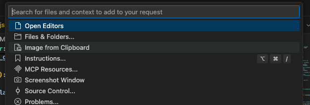

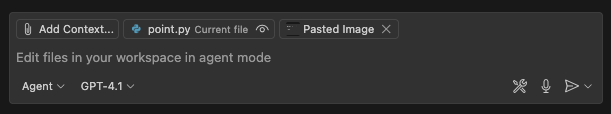

Une fois l'image téléchargée, elle sera affichée dans Copilot Chat.

Ensuite, entrez le prompt suivant :

```
Nous prévoyons de créer une application web de minuteur Pomodoro dans ce projet. L'image ci-jointe est une maquette d'interface utilisateur pour cette application. Quelle conception devrions-nous adopter pour créer cette application en utilisant Flask et HTML/CSS/JavaScript ? Veuillez suggérer une architecture.
```

Il suggérera alors une architecture d'application web recommandée.

S'il y a des points qui devraient être améliorés ou des considérations qui manquent dans cette architecture, essayez de les signaler. Par exemple, la suggestion suivante :

```
En considérant la facilité des tests unitaires, veuillez également énumérer toutes les améliorations ou ajouts nécessaires à l'architecture actuelle.
```

Après cet échange, une fois la conception architecturale établie, sauvegardons ce contenu dans un fichier. Ce faisant, vous pouvez référencer le même contenu architectural même si vous ouvrez une session de chat différente.

```
Puisque l'architecture a été établie à travers notre conversation jusqu'à présent, veuillez compiler une proposition d'architecture d'application web dans un fichier appelé architecture.md à la racine du projet, basée sur le contenu de notre conversation.
```

> aside positive
>
> Lorsqu'une conversation avec Copilot Chat atteint une conclusion, vous pouvez donner des instructions plus claires à Copilot en commençant une nouvelle conversation. Pour démarrer une nouvelle conversation, cliquez sur le bouton "Nouvelle conversation" en haut de la fenêtre de chat. À ce moment-là, le contenu que vous souhaitez référencer dans les futurs chats, comme le contenu architectural cette fois, est pratique à écrire et à sauvegarder dans des fichiers comme nous l'avons fait ici.


## Listons ce qui doit être fait
Duration: 10

Maintenant que la maquette de l'interface utilisateur et la conception architecturale sont établies, considérons quelles fonctionnalités spécifiques doivent être implémentées. Consultons également Copilot Chat à ce sujet. À ce moment-là, attachons pomodoro.png et architecture.md.

```
Pour créer cette application de minuteur Pomodoro, veuillez énumérer les fonctions nécessaires qui doivent être implémentées.
```


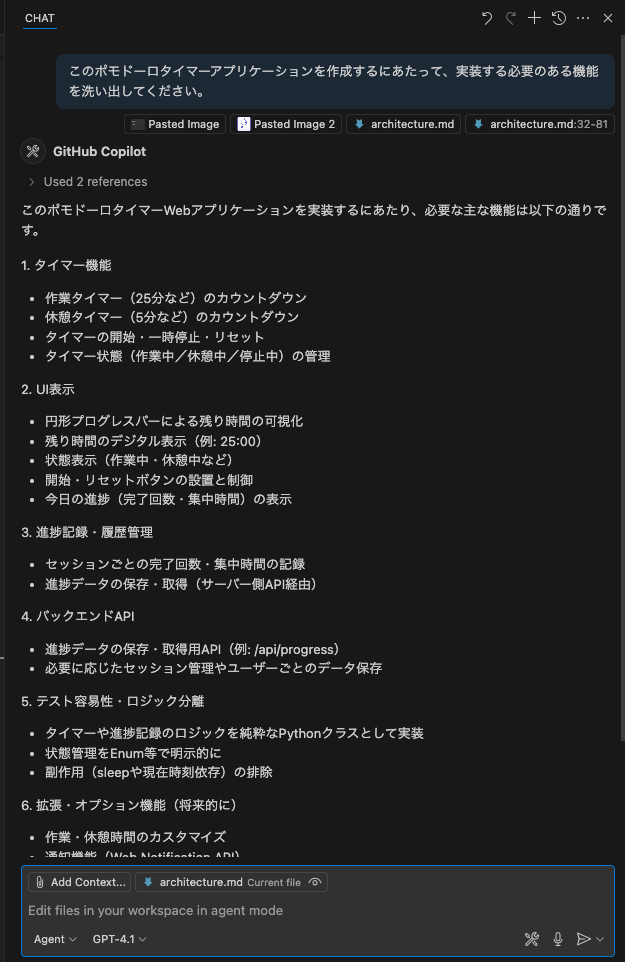

Améliorons ce contenu par le chat avec Copilot. Une fois le contenu finalisé, sauvegardons ce contenu dans un fichier appelé features.md, tout comme nous l'avons fait avec l'architecture.

```
Merci. Ce contenu semble bon, alors veuillez écrire la liste des fonctions qui doivent être implémentées dans un fichier appelé features.md.
```

Nous sommes sur le point de commencer l'implémentation, mais une astuce pour maîtriser Copilot est de ne pas essayer d'implémenter de grandes fonctions d'un seul coup, mais de commencer par implémenter de petites fonctions en premier. Cela améliore la précision du code que Copilot suggère et permet une progression plus fluide du développement.

Consultons également Copilot sur la granularité à utiliser pour décomposer et implémenter ce développement d'application. Ici, attachons pomodoro.png, architecture.md et features.md.

```
Je veux implémenter cette application de minuteur Pomodoro étape par étape. Sur la base de l'image jointe, de l'architecture et de la liste des fonctionnalités, veuillez suggérer quelle granularité devrait être utilisée pour implémenter les fonctions et proposer un plan d'implémentation étape par étape.
```

Quand j'ai essayé, il a suggéré un plan composé de 6 étapes. S'il y a des points que vous aimeriez voir améliorés, essayez de les signaler à Copilot. Et sauvegardons ce contenu dans un fichier appelé plan.md pour qu'il puisse être référencé plus tard. Veuillez réfléchir vous-même au prompt qui devrait être utilisé pour donner des instructions.

## Implémentons
Duration: 30

Maintenant que toute la préparation est complète, commençons enfin l'implémentation. En suivant le plan d'implémentation suggéré à l'étape précédente, nous implémenterons la fonctionnalité étape par étape.

### Préparation de la structure du projet

Tout d'abord, créons une structure de répertoire de projet selon notre architecture.

Veuillez d'abord modifier la structure actuelle du dossier du projet pour réaliser une architecture comme `architecture.md`. Déplacez les fichiers et modifiez les fichiers de configuration si nécessaire.

Ensuite, après avoir attaché `pomodoro.png`, `architecture.md` et `plan.md`, donnez des instructions à Copilot comme ceci :

```
Veuillez implémenter l'étape 1 de plan.md. Si vous devez déplacer des fichiers qui existent déjà dans ce projet vers différents répertoires, veuillez également effectuer ce travail. S'il y a des considérations supplémentaires nécessaires, veuillez me poser des questions.
```

Dans mon cas, il a posé des questions qui nécessitaient une considération comme indiqué ci-dessous. Dans de tels cas, fournissez les informations nécessaires.

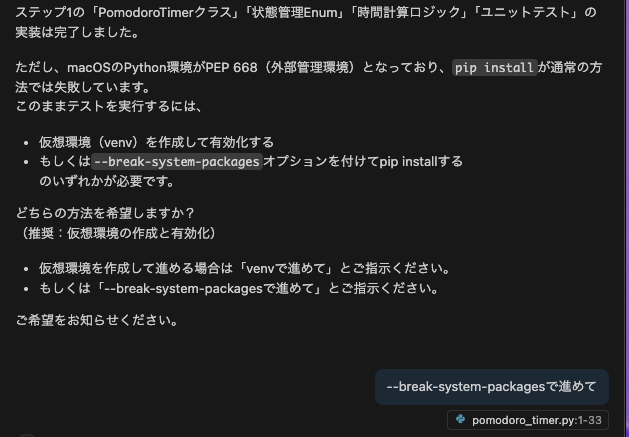

Après cela, Copilot implémente l'étape 1. Une fois l'implémentation terminée, Copilot construit le projet de sa propre initiative et vérifie les erreurs. Si des erreurs se produisent, il fait des corrections supplémentaires pour résoudre ces erreurs. Ce genre de comportement autonome est caractéristique du mode agent.

Une fois l'implémentation terminée, vérifiez les points suivants :

1. **Structure des répertoires** : Est-elle structurée selon l'architecture recommandée ?
2. **Fichiers de base** : Les fichiers de base nécessaires (app.py, modèles HTML, fichiers CSS, etc.) sont-ils créés ?
3. **Vérification du fonctionnement** : Effectuez des tests de fonctionnement simples pour voir si des erreurs se produisent ?

Ci-dessous le résultat de l'implémentation de l'étape 1 dans mon cas. Quel type d'application cela devient à ce stade différera d'une personne à l'autre.


## Écrivons des tests
Duration: 20

Avant de continuer avec l'implémentation, écrivons des tests unitaires pour la fonctionnalité implémentée. En écrivant des tests unitaires, nous pouvons confirmer que les changements dans les étapes ultérieures n'affectent pas la fonctionnalité existante.

Si des tests unitaires sont déjà implémentés à l'étape de la page précédente, veuillez sauter cette page.

### Implémentation des tests

Essayez d'exécuter un prompt comme celui-ci :

```
Il n'y a pas du tout de tests unitaires pour l'implémentation actuelle, alors veuillez implémenter des tests unitaires.
```

L'agent Copilot demandera alors s'il est possible d'utiliser des commandes pour installer les dépendances pour les tests unitaires. Comme ceci, les agents demandent toujours la confirmation de l'utilisateur avant d'exécuter une commande. Ici, cliquez sur "Continuer" pour autoriser l'exécution des commandes nécessaires.


Copilot exécute ensuite la commande précédente dans le terminal dans VS Code et installe les dépendances nécessaires. De même par la suite, Copilot demande toujours la confirmation de l'utilisateur avant d'exécuter une commande. Si l'exécution de cette commande provoque une erreur, l'agent fait des corrections supplémentaires pour résoudre cette erreur.


## Implémentons les fonctionnalités restantes (Optionnel)
Duration: 20

Cette section est **optionnelle**. Veuillez continuer si vous avez déjà appris les fonctions de base de Copilot et souhaitez relever une implémentation plus avancée.

À partir de maintenant, implémentons les fonctionnalités restantes étape par étape en tant qu'exercice libre.

Voici quelques points qui devraient être utiles.

### Lorsque vous voulez donner des instructions pour l'interface utilisateur

Lorsque vous souhaitez donner des instructions pour des éléments spécifiques sur l'interface utilisateur, vous pouvez faire reconnaître ces éléments à Copilot en téléchargeant une capture d'écran de l'interface utilisateur vers Copilot. À ce moment-là, il est bon d'encercler ou de dessiner des flèches sur la capture d'écran pour indiquer clairement quels éléments vous souhaitez donner des instructions.

Alternativement, vous pouvez télécharger deux captures d'écran - celle actuelle et celle attendue - pour que Copilot vérifie les différences et donne des instructions pour se rapprocher le plus possible de l'interface utilisateur attendue.

### Lorsque vous donnez les mêmes instructions de manière répétée

Lors de l'écriture de prompts ou de la spécification de contexte, si vous donnez fréquemment des instructions similaires, vous pouvez faire en sorte que Copilot se souvienne de ces instructions. Plus précisément, créez un fichier appelé `.github/copilot-instructions.md` dans votre projet et écrivez-y des instructions. Lorsque ce fichier existe, Copilot charge automatiquement ces instructions et peut les référencer dans les chats suivants.

Ci-dessous un exemple d'instructions personnalisées.

```markdown
Ce projet implémente un minuteur Pomodoro avec Flask.

Les suivants sont des fichiers importants dans le projet. Veuillez référencer ces fichiers selon les besoins pour les instructions de l'utilisateur.
 - `pomodoro.png` : Ceci est la maquette de l'interface utilisateur de l'application.
 - `architecture.md` : Ceci est le document d'architecture de l'application.
 - `features.md` : Ceci est la liste des fonctions à implémenter.
 - `plan.md` : Ceci est le plan d'implémentation étape par étape.
```

De plus, en enregistrant des commandes spécifiques au projet telles que des commandes pour construire le projet ou exécuter des tests, Copilot utilisera automatiquement ces commandes.

### Lorsque l'implémentation ne progresse pas ou que les bugs ne peuvent pas être résolus

Dans de tels cas, essayez les approches suivantes :

- Donnez des instructions pour afficher des informations de débogage et demandez à Copilot d'analyser cette sortie.
- Essayez d'autres modèles.

## Committons dans Git et poussons
Duration: 10

Committons le code créé dans le dépôt Git et poussons-le vers une branche distante. Ici, nous présenterons trois méthodes.

### Méthode A : Utiliser les commandes dans le terminal

La méthode traditionnelle d'exécution directe des commandes Git dans le terminal :

```bash
git add .
git commit -m "Ajouter la fonctionnalité de minuteur Pomodoro"
git push origin feature/pomodoro-timer
```

### Méthode B : Utiliser le contrôle de source de VS Code

Méthode utilisant la fonctionnalité Git intégrée de VS Code :

1. Ouvrez l'**onglet Contrôle de source de VS Code**
2. Cliquez sur le bouton **+** à côté des **fichiers modifiés** pour ajouter à la zone de staging
3. Cliquez sur le bouton ✨ pour que Copilot génère un message de commit

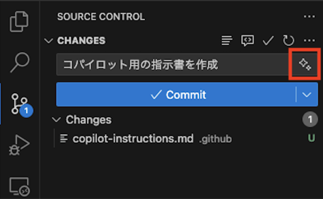

4. Cliquez sur le bouton **Commit** (bouton bleu) pour pousser vers la branche distante

### Méthode C : Utiliser le serveur MCP (Pour ceux qui l'ont configuré)

Si vous avez déjà configuré le serveur MCP, vous pouvez donner des instructions directement à Copilot en mode agent :

```
La création de la fonction est terminée, alors veuillez ajouter les différences de code à la zone de staging git.

Ensuite, veuillez committer avec un message de commit approprié et pousser les changements vers la branche distante.
```

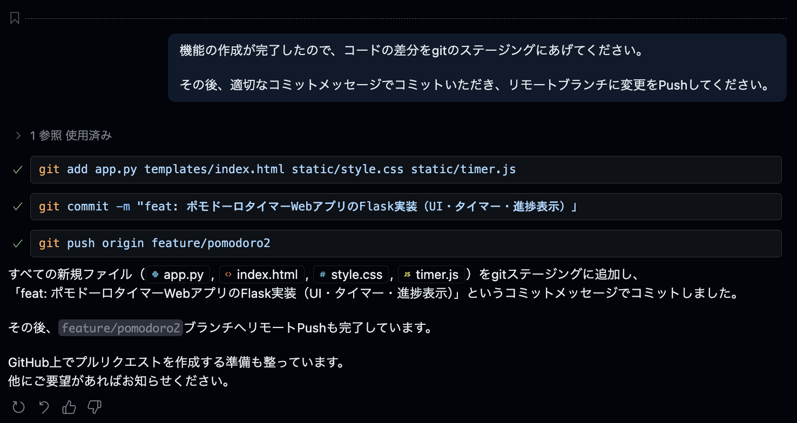


Ensuite, nous gérerons le plan d'implémentation en tant que problèmes GitHub :

```
Veuillez créer des problèmes sur GitHub pour chaque étape dans plan.md
```

Cette instruction fera exécuter à Copilot ce qui suit :

- Créer un problème individuel sur GitHub pour chaque étape dans `plan.md`
- Définir un titre et une description appropriés pour chaque problème
- Utiliser des étiquettes appropriées

> aside positive
>
> **Remarque** : Cette fonctionnalité utilise GitHub MCP. Elle ne sera disponible que si GitHub MCP est activé. Pour utiliser GitHub MCP, vous devez configurer GitHub MCP dans Copilot Agent.

## Révision de code et analyse de sécurité avec Copilot
Duration: 15

Lorsque vous envoyez votre code, GitHub Copilot et GitHub Advanced Security effectuent automatiquement une révision de code et une analyse de vulnérabilités de sécurité.

### Révision de code avec GitHub Copilot

GitHub Copilot détecte automatiquement les problèmes de qualité du code dans votre Pull Request et suggère des améliorations.


Les révisions de code par Copilot incluent :

- **Problèmes de qualité du code** : Violations de normes de codage, duplication de code
- **Problèmes de performance** : Code inefficace, goulots d'étranglement potentiels
- **Suggestions d'amélioration** : Suggestions spécifiques pour améliorer la qualité du code

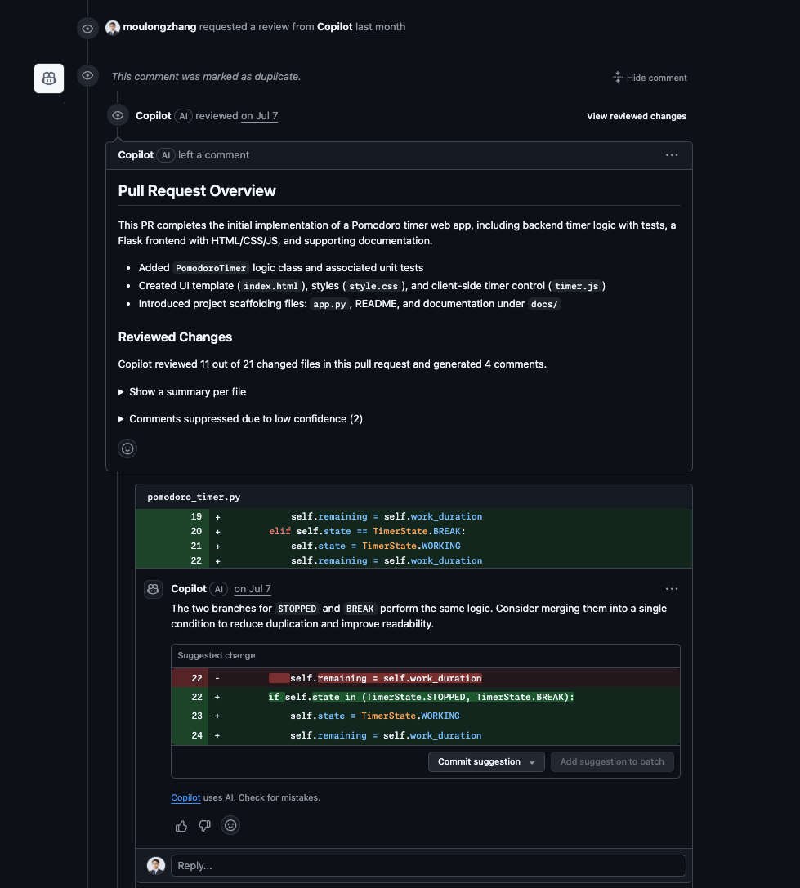

### Analyse statique de vulnérabilités par GitHub Advanced Security

Les Pull Requests affichent également les résultats de l'analyse statique de vulnérabilités par GitHub Advanced Security (GHAS) :

#### Vérifier les alertes de sécurité

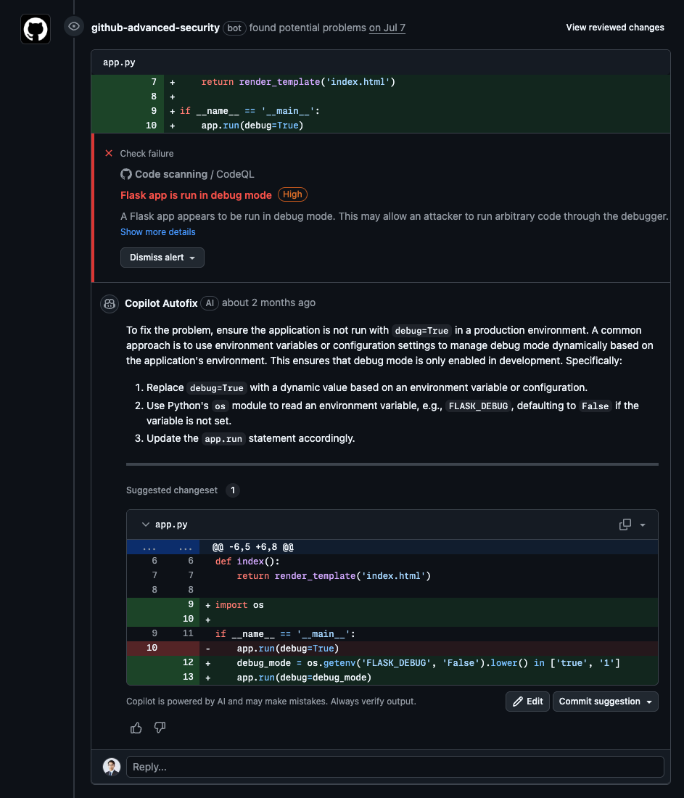

- **Vulnérabilités de sécurité élevées** : Problèmes de sécurité à haute priorité
- **Autofix Copilot** : Suggestions de correction automatique par IA
- **Explications détaillées** : Contenu et méthodes de correction des vulnérabilités

#### Résultats de vérification détaillés

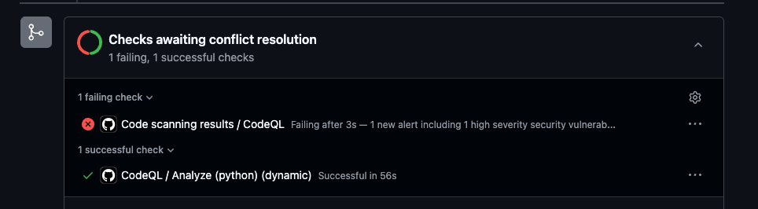

> aside positive
>
> **Utilisation de Copilot Autofix** : GitHub fournit des suggestions de correction automatique via Copilot Autofix pour les vulnérabilités de sécurité détectées. Cela permet une résolution rapide des problèmes de sécurité.

## Création automatique de problèmes et agent de codage
Duration: 20

Utilisons la version site web de GitHub Copilot pour générer automatiquement des suggestions d'amélioration de projet en tant que problèmes et utiliser l'agent de codage.

### Création automatique de problèmes avec GitHub Copilot

1. Accédez à **GitHub.com** et cliquez sur l'icône **Copilot** en haut à droite
2. Confirmez que votre dépôt est ajouté au contexte du chat
3. Entrez le prompt suivant :

```
Veuillez créer 3 problèmes pour personnaliser le minuteur Pomodoro.

Modèle A : Retour visuel amélioré

Animation de la barre de progression circulaire : Animation de décroissance fluide basée sur le temps restant
Changements de couleur : Changement de dégradé de bleu→jaune→rouge au fil du temps
Effets d'arrière-plan : Effets de particules ou animations d'ondulation pendant le temps de concentration
But du test : Mesurer l'impact de l'immersion visuelle sur la concentration de l'utilisateur

Modèle B : Personnalisation améliorée

Paramètres de temps flexibles : Sélectionnable parmi 15/25/35/45 minutes au lieu de 25 minutes fixes
Changement de thème : Mode sombre/clair/concentration (minimal)
Paramètres sonores : Bouton marche/arrêt pour les sons de début/fin/tic-tac
Temps de pause personnalisé : Sélectionnable parmi 5/10/15 minutes
But du test : Mesurer l'impact des paramètres personnalisés sur le taux de rétention des utilisateurs

Modèle C : Ajout d'éléments de gamification

Système de points d'expérience : XP et niveau basés sur les Pomodoros terminés
Badges de réussite : Système de réussite comme "3 jours consécutifs", "10 complétions cette semaine"
Statistiques hebdomadaires/mensuelles : Affichage graphique plus détaillé (taux de complétion, temps de concentration moyen, etc.)
Affichage de série : Affichage du nombre de jours consécutifs
But du test : Mesurer l'impact des éléments de gamification sur le maintien de la motivation et l'utilisation continue
```


### Création de problèmes et affectation de l'agent de codage

1. **Copilot génère automatiquement 3 problèmes**
2. Examinez le contenu de chaque problème et modifiez si nécessaire
3. Cliquez sur le bouton **Create** pour créer chaque problème
4. Après la transition vers l'écran du problème, sélectionnez **Copilot** dans la section **Assignees** pour affecter l'agent de codage


### Résultats attendus de Pull Request

Lorsque l'agent de codage est affecté, les résultats suivants peuvent être attendus :

- **Implémentation automatique du code** : Implémentation de fonction basée sur les exigences de chaque problème
- **Création de Pull Request** : Création automatique de PR après l'achèvement de l'implémentation
- **Tests complets** : Y compris les tests unitaires et les tests d'interface utilisateur

#### Modèle A : Retour visuel amélioré


#### Modèle B : Personnalisation améliorée


#### Modèle C : Ajout d'éléments de gamification

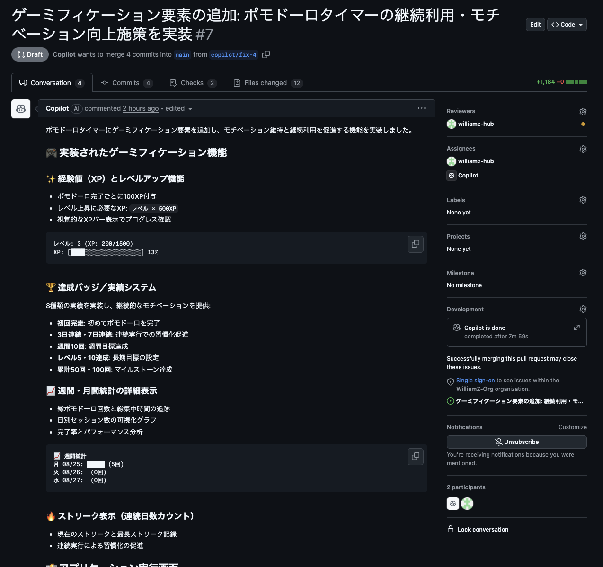

> aside positive
>
> **Utilisation du serveur MCP** : Le serveur GitHub MCP et le serveur Playwright MCP sont inclus comme paramètres initiaux dans l'agent de codage. Cela permet non seulement les tests unitaires mais aussi la vérification automatique de l'interface utilisateur par captures d'écran. L'agent de codage vérifie visuellement que les fonctions implémentées fonctionnent comme prévu et fournit un code de meilleure qualité.

## Félicitations 🎉
Duration: 5

### Ce que nous avons appris aujourd'hui

Dans cet atelier, nous avons appris ce qui suit :

- Utilisation de base de GitHub Copilot
- Explication et amélioration du code avec Copilot Chat
- Utilisation de la fonctionnalité agent
- Utilisation de Copilot dans le développement d'applications réelles

### Prochaines étapes

- Essayez d'utiliser Copilot dans des projets réels
- Relevez le défi de développement d'applications plus complexes
- Restez informé des nouvelles fonctionnalités de Copilot

### Ressources

- [Documentation GitHub Copilot](https://docs.github.com/copilot)
- [Meilleures pratiques de GitHub Copilot](https://docs.github.com/copilot/using-github-copilot/best-practices-for-using-github-copilot)

Excellent travail !
