author: Your Name
summary: GitHub Copilot Workshop
id: github-copilot-workshop
categories: AI, Development
environments: Web
status: Published
feedback link: https://example.com/feedback

# GitHub Copilot Workshop

## About the Workshop
Duration: 5

Welcome to the GitHub Copilot Workshop! In this workshop, you will learn how to use GitHub Copilot to explain and improve code.
GitHub Copilot Chat enables interactive dialogue with AI through a chat experience. Let's learn how to use GitHub Copilot through this workshop!


### Today's Goals
- Understand the various features of GitHub Copilot
- Develop a new application using agent mode

### Prerequisites
- Visual Studio Code is installed
- GitHub Copilot license is available
- GitHub account is available

## Project Setup
Duration: 15

This workshop uses the following GitHub repository:

**Project URL**: https://github.com/moulongzhang/2025-Github-Copilot-Workshop-Python

### Step 1: Fork the Repository

First, open the project URL above in your browser and fork the repository:

1. Open the project URL (https://github.com/moulongzhang/2025-Github-Copilot-Workshop-Python) in your browser
2. Click the **Fork** button in the top right


3. Click the **Create fork** button on the fork creation screen


Once the fork is complete, a copy of the repository will be created in your GitHub account.

### Step 2: Development Environment Setup

You can start the project using your forked repository with either of the following methods:

#### Method A: Using GitHub Codespaces (Recommended)

1. On your forked repository page (`https://github.com/[your-username]/2025-Github-Copilot-Workshop-Python`)
2. Click the green **Code** button
3. Select the **Codespaces** tab
4. Click **Create codespace on main**


> aside positive
>
> **Tip**: Using Codespaces launches a VS Code-like environment in your browser, allowing you to start development immediately.


#### Method B: Clone to Local Environment

If you have VS Code installed locally:

1. Open Terminal or Command Prompt
2. Clone your forked repository with the following command:

```bash
git clone https://github.com/[your-username]/2025-Github-Copilot-Workshop-Python.git
```

3. Navigate to the cloned directory:

```bash
cd 2025-Github-Copilot-Workshop-Python
```

4. Open the project in VS Code:

```bash
code .
```

### Step 3: Install Required Extensions

After opening the project, please install the following extensions:

1. Install the **GitHub Copilot** extension
2. Install the **GitHub Copilot Chat** extension
3. Install the **Python** extension

### Step 4: Configuration Verification

1. Confirm that you have successfully signed in to your GitHub account in VS Code
2. Confirm that Copilot functionality is enabled
3. Confirm that the Python interpreter is correctly configured

## Try Using Code Completion
Duration: 10

Let's experience GitHub Copilot's basic code completion functionality.

### Install Copilot Extensions

1. Install the **GitHub Copilot** extension
2. Install the **GitHub Copilot Chat** extension

### Configuration Verification
Confirm that you have successfully signed in VS Code.

### Try Code Completion

Create a new Python file and enter the following comment:

```python
# Function to calculate Fibonacci sequence
def fibonacci(n):
```

Confirm that Copilot automatically suggests code for you.

> aside positive
>
> **Tip**: You can accept suggestions with the `Tab` key, and view the next suggestion with `Alt+]`.

## GitHub Copilot Next Edit Suggestions Activation Instructions
Duration: 10

### Overview
⚙️ [`github.copilot.nextEditSuggestions.enabled`](vscode://settings/github.copilot.nextEditSuggestions.enabled) is a setting that enables GitHub Copilot's next-generation edit suggestion feature. This feature allows you to receive more advanced code editing suggestions.

### 1. Open VS Code

### 2. Access Settings Screen
Open the settings screen using one of the following methods:

#### Method A: From Menu
- **Windows/Linux**: `File` → `Preferences` → `Settings`
- **macOS**: `Code` → `Settings...` → `Settings`

#### Method B: Keyboard Shortcut
- **Windows/Linux**: `Ctrl + ,`
- **macOS**: `Cmd + ,`

#### Method C: Command Palette
- `Ctrl + Shift + P` (Windows/Linux) or `Cmd + Shift + P` (macOS)
- Select `Preferences: Open Settings (UI)`

### 3. Search Settings
Enter the following in the settings search box:
```
github.copilot.nextEditSuggestions.enabled
```

### 4. Enable Setting
- Check the checkbox for the setting item shown in search results
- Or change `false` to `true`

### 5. Confirm Setting
Verify the setting is correctly applied:
- Restart VS Code (recommended)
- Edit code in the editor and confirm the new suggestion feature works

### Alternative Method: Direct Edit in settings.json

#### 1. Open settings.json file
- `Ctrl + Shift + P` (Windows/Linux) or `Cmd + Shift + P` (macOS)
- Select `Preferences: Open User Settings (JSON)`

#### 2. Add Setting
```json
{
    "github.copilot.nextEditSuggestions.enabled": true
}
```

#### 3. Save File
- `Ctrl + S` (Windows/Linux) or `Cmd + S` (macOS)

### Let's Try It Out

Please open the `point.py` file included in the project. This file contains a class representing points in two-dimensional space:

```python
import math

class Point2D:
    def __init__(self, x, y):
        self.x = x
        self.y = y
    
    def distance_to(self, other):
        dx = self.x - other.x
        dy = self.y - other.y
        return math.sqrt(dx * dx + dy * dy)
    
    def __str__(self):
        return f"Point2D({self.x}, {self.y})"
```

Now, we want to extend this class to represent points in three-dimensional space. First, let's manually change the class name to `Point3D`. GitHub Copilot will then suggest the next edit candidates.

> aside positive
>
> **Important**: It may take some time for Next Edit Suggestions to appear. Please be patient and wait.

The suggestions should show changes like the following:
- Adding the `z` parameter to the `__init__` method
- Adding `self.z = z`
- Extending the `distance_to` method to three-dimensional distance calculation
- Displaying z coordinates in the `__str__` method

In this state, pressing the `Tab` key will move the cursor to the location where GitHub Copilot is suggesting. To accept the suggestion, press the `Tab` key again.

GitHub Copilot should then suggest the next edit candidate. You can also accept this suggestion by pressing the `Tab` key. This way, you can efficiently edit code using Next Edit Suggestions.

### Let's Look at the Results

Let's continue working on extending the Point2D class to Point3D. You should be able to make all methods compatible with three-dimensional space.

Example of expected final code:

```python
import math

class Point3D:
    def __init__(self, x, y, z):
        self.x = x
        self.y = y
        self.z = z
    
    def distance_to(self, other):
        dx = self.x - other.x
        dy = self.y - other.y
        dz = self.z - other.z
        return math.sqrt(dx * dx + dy * dy + dz * dz)
    
    def __str__(self):
        return f"Point3D({self.x}, {self.y}, {self.z})"
```

### Let's Also Try with TODO Comments

Replace `二次元` (two-dimensional) with `三次元` (three-dimensional) in the commented first line.

```python
# Class representing points in three-dimensional space
class Point2D:
    def __init__(self, x, y):
        self.x = x
        self.y = y
    
    def distance_to(self, other):
        # TODO: Add distance calculation code here
        pass
    
    def __str__(self):
        # TODO: Return string representation
        pass
```

Place the cursor after the TODO comments and check Copilot's suggestions.

### Important Notes

- Make sure VS Code's GitHub Copilot extension is updated to the latest version
- Restarting VS Code is recommended after setting changes

### Troubleshooting

#### If Settings Are Not Found
1. Confirm GitHub Copilot extension is installed
2. Confirm extension is updated to the latest version
3. Restart VS Code and try again

#### If Functionality Doesn't Work
1. Confirm you are logged in to GitHub Copilot
2. Check internet connection
3. Check VS Code console for error messages

## Copilot Chat Hands-on Preparation
Duration: 5

### Create File

Please save the following file as `delivery_manager.py`.

```python
import time
import random
from typing import List, Callable, Optional
from dataclasses import dataclass, field
from enum import Enum


class EventArgs:
    """Base class for event arguments"""
    pass


class Event:
    """Class equivalent to C# event"""
    
    def __init__(self):
        self._handlers: List[Callable] = []
    
    def add_handler(self, handler: Callable):
        """Add event handler"""
        if handler not in self._handlers:
            self._handlers.append(handler)
    
    def remove_handler(self, handler: Callable):
        """Remove event handler"""
        if handler in self._handlers:
            self._handlers.remove(handler)
    
    def invoke(self, sender, args: EventArgs = None):
        """Fire event"""
        for handler in self._handlers:
            handler(sender, args or EventArgs())


@dataclass
class KitchenObjectSO:
    """Kitchen object data class"""
    name: str
    object_id: int


@dataclass
class RecipeSO:
    """Recipe data class"""
    name: str
    kitchen_object_so_list: List[KitchenObjectSO] = field(default_factory=list)


@dataclass
class RecipeListSO:
    """Recipe list data class"""
    recipe_so_list: List[RecipeSO] = field(default_factory=list)


class PlateKitchenObject:
    """Plate kitchen object"""
    
    def __init__(self):
        self._kitchen_object_so_list: List[KitchenObjectSO] = []
    
    def add_kitchen_object(self, kitchen_object: KitchenObjectSO):
        """Add kitchen object"""
        self._kitchen_object_so_list.append(kitchen_object)
    
    def get_kitchen_object_so_list(self) -> List[KitchenObjectSO]:
        """Get kitchen object list"""
        return self._kitchen_object_so_list.copy()


class KitchenGameManager:
    """Kitchen game manager (Singleton)"""
    
    _instance: Optional['KitchenGameManager'] = None
    
    def __init__(self):
        self._is_game_playing = False
    
    @classmethod
    def get_instance(cls) -> 'KitchenGameManager':
        """Get Singleton instance"""
        if cls._instance is None:
            cls._instance = cls()
        return cls._instance
    
    def is_game_playing(self) -> bool:
        """Check if game is in progress"""
        return self._is_game_playing
    
    def start_game(self):
        """Start game"""
        self._is_game_playing = True
    
    def stop_game(self):
        """Stop game"""
        self._is_game_playing = False


class DeliveryManager:
    """Delivery management class (Python version)"""
    
    _instance: Optional['DeliveryManager'] = None
    
    def __init__(self, recipe_list_so: RecipeListSO):
        # Event definitions
        self.on_recipe_spawned = Event()
        self.on_recipe_completed = Event()
        self.on_recipe_success = Event()
        self.on_recipe_failed = Event()
        
        # Private variables
        self._recipe_list_so = recipe_list_so
        self._waiting_recipe_so_list: List[RecipeSO] = []
        self._spawn_recipe_timer = 0.0
        self._spawn_recipe_timer_max = 4.0
        self._waiting_recipes_max = 4
        self._successful_recipes_amount = 0
        self._last_update_time = time.time()
    
    @classmethod
    def get_instance(cls, recipe_list_so: RecipeListSO = None) -> 'DeliveryManager':
        """Get Singleton instance"""
        if cls._instance is None:
            if recipe_list_so is None:
                raise ValueError("recipe_list_so is required for initial creation")
            cls._instance = cls(recipe_list_so)
        return cls._instance
    
    def update(self):
        """Frame update processing (Unity Update equivalent)"""
        current_time = time.time()
        delta_time = current_time - self._last_update_time
        self._last_update_time = current_time
        
        self._spawn_recipe_timer -= delta_time
        
        if self._spawn_recipe_timer <= 0.0:
            self._spawn_recipe_timer = self._spawn_recipe_timer_max
            
            kitchen_game_manager = KitchenGameManager.get_instance()
            if (kitchen_game_manager.is_game_playing() and 
                len(self._waiting_recipe_so_list) < self._waiting_recipes_max):
                
                # Randomly select recipe
                waiting_recipe_so = random.choice(self._recipe_list_so.recipe_so_list)
                self._waiting_recipe_so_list.append(waiting_recipe_so)
                
                # Fire event
                self.on_recipe_spawned.invoke(self)
    
    def deliver_recipe(self, plate_kitchen_object: PlateKitchenObject):
        """Check if recipe ingredients match plate ingredients"""
        
        for i, waiting_recipe_so in enumerate(self._waiting_recipe_so_list):
            plate_ingredients = plate_kitchen_object.get_kitchen_object_so_list()
            
            # Check if ingredient count matches
            if len(waiting_recipe_so.kitchen_object_so_list) == len(plate_ingredients):
                plate_contents_matches_recipe = True
                
                # Check each ingredient in recipe
                for recipe_kitchen_object_so in waiting_recipe_so.kitchen_object_so_list:
                    ingredient_found = False
                    
                    # Compare with plate ingredients
                    for plate_kitchen_object_so in plate_ingredients:
                        if plate_kitchen_object_so == recipe_kitchen_object_so:
                            ingredient_found = True
                            break
                    
                    if not ingredient_found:
                        plate_contents_matches_recipe = False
                        break
                
                # If ingredients match completely
                if plate_contents_matches_recipe:
                    self._successful_recipes_amount += 1
                    self._waiting_recipe_so_list.pop(i)
                    
                    # Fire success events
                    self.on_recipe_completed.invoke(self)
                    self.on_recipe_success.invoke(self)
                    return
        
        # If no matching recipe found
        self.on_recipe_failed.invoke(self)
    
    def get_waiting_recipe_so_list(self) -> List[RecipeSO]:
        """Get waiting recipe list"""
        return self._waiting_recipe_so_list.copy()
    
    def get_successful_recipes_amount(self) -> int:
        """Get number of successful recipes"""
        return self._successful_recipes_amount


# Usage example
if __name__ == "__main__":
    # Create sample data
    tomato = KitchenObjectSO("Tomato", 1)
    lettuce = KitchenObjectSO("Lettuce", 2)
    bread = KitchenObjectSO("Bread", 3)
    
    # Sample recipes
    sandwich_recipe = RecipeSO("Sandwich", [bread, lettuce, tomato])
    salad_recipe = RecipeSO("Salad", [lettuce, tomato])
    
    recipe_list = RecipeListSO([sandwich_recipe, salad_recipe])
    
    # Initialize game manager and delivery manager
    game_manager = KitchenGameManager.get_instance()
    game_manager.start_game()
    
    delivery_manager = DeliveryManager.get_instance(recipe_list)
    
    # Set up event handlers
    def on_recipe_spawned(sender, args):
        print("New recipe has been generated!")
    
    def on_recipe_success(sender, args):
        print("Recipe delivery success!")
    
    def on_recipe_failed(sender, args):
        print("Recipe delivery failed...")
    
    delivery_manager.on_recipe_spawned.add_handler(on_recipe_spawned)
    delivery_manager.on_recipe_success.add_handler(on_recipe_success)
    delivery_manager.on_recipe_failed.add_handler(on_recipe_failed)
    
    # Sample execution
    print("Game starting...")
    
    # Run update processing for 5 seconds
    start_time = time.time()
    while time.time() - start_time < 5:
        delivery_manager.update()
        time.sleep(0.1)  # Update every 100ms
    
    print(f"Number of waiting recipes: {len(delivery_manager.get_waiting_recipe_so_list())}")
    
    # Sample delivery test
    plate = PlateKitchenObject()
    plate.add_kitchen_object(bread)
    plate.add_kitchen_object(lettuce)
    plate.add_kitchen_object(tomato)
    
    print("Delivering sandwich...")
    delivery_manager.deliver_recipe(plate)
    
    print(f"Number of successful recipes: {delivery_manager.get_successful_recipes_amount()}")
```

## Explain the Code
Duration: 15

Let's have Copilot Chat explain this code.

### Open Copilot Chat

1. Click the **Chat** icon (chat bubble icon) in VS Code's sidebar to open Copilot Chat
2. Or open the Chat panel with `Ctrl+Alt+I` (macOS: `Ctrl+Cmd+I`)

### Check Chat Mode

Confirm the chat mode is set to "Question" (we'll introduce "Agent" mode later).

### Request File Explanation

1. Enter `#delivery_manager.py` in the chat field
2. Enter the prompt "Please explain this entire file."
3. Press Enter and Copilot Chat will explain the entire `delivery_manager.py` file

> aside positive
>
> **Tip**: By adding `#` before a filename, you can include that entire file as context.

## Ask About Code Improvement Areas
Duration: 15

### Exercise

Let's ask Copilot Chat about the problematic parts of this code.

### 1. Ask About Overall Class Issues

First, let's ask what problems this code has as a whole class.

Ask Copilot Chat:

```
Looking at this entire DeliveryManager class, what problems and improvement points are there? Please tell me from the perspectives of design patterns, code quality, and maintainability.
```

### 2. Focus on Specific Methods for Improvement Points

Then, focusing on the `deliver_recipe()` method, let's ask what methods there are to improve this method.

#### Steps:
1. Enter `#deliver_recipe` in the chat field
2. Code element candidates (functions, classes, variables, etc.) will be displayed
3. Select the `deliver_recipe` method
4. Enter the following question:

```
What are some ways to improve this deliver_recipe method? Please suggest from the perspectives of readability, performance, and error handling.
```

> aside positive
>
> **Tip**: By using `#`, you can ask pinpointed questions about specific code elements. This allows you to get more specific and useful improvement suggestions.

### Code Review Function

To improve the current code, ask Copilot Chat the following:

```
Please improve this Python code. I'd like suggestions from the perspectives of performance, readability, and error handling.
```

### Check from Security Perspective

```
Are there any security issues with this code?
```

### Check Best Practices

```
Please check if this follows Python best practices.
```

## Try Using Agent Mode
Duration: 10

So far we've been using Copilot Chat in "Question" mode, but now let's try "Agent" mode. Agents can understand user intent and execute tasks more autonomously. Through practical examples, we'll learn how agents function.

### Switch to Agent Mode

First, with the `delivery_manager.py` file open, select "Agent" from the mode selection in Copilot Chat.

<div align="center">
  
  
  <div style="height: 24;"></div>
  
  
</div>

### Identify Issues

Then, enter the following prompt:

```
Please list the issues that exist in the DeliveryManager class. Then, present improvement proposals to solve each of these issues.
```

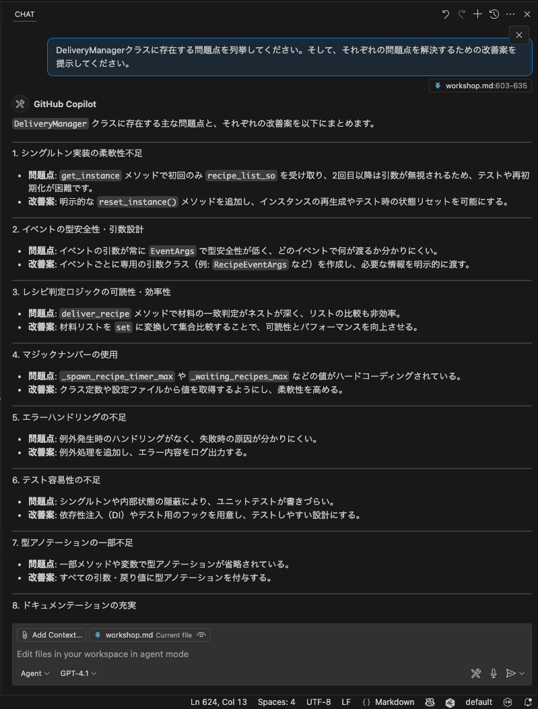

This should suggest multiple improvement points.

### Try with Different Models

By trying the same question with different models, you can compare the characteristics of each model.

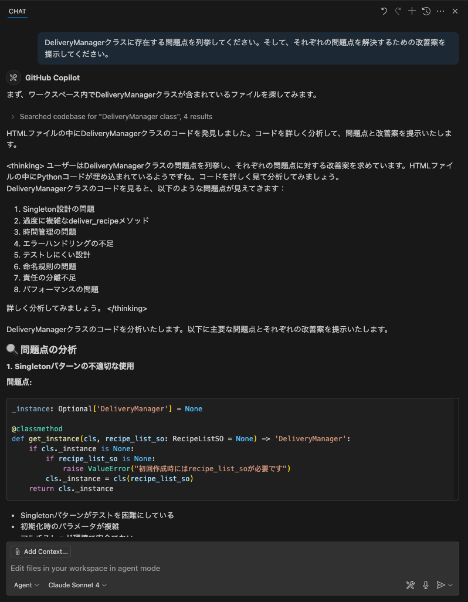

### Implement Improvement Proposals

Now, let's have the suggested improvement proposals actually implemented.

```
Please implement all the improvement proposals you presented.
```

Copilot will then make direct code changes to the code open in the editor. However, this is still at the proposal stage, and the user decides whether to accept these changes. You can accept or reject by clicking the "Keep" or "Undo" buttons above the chat field.

### Agent Autonomy

Here, let's check the comments the agent returned. The agent didn't just change the code according to instructions, but may have confirmed that errors occurred after changing the code and tried to fix those errors as well. In an appropriate environment, the agent automatically detects errors that occur after code changes and attempts to fix them. This way, agents can understand user intent and execute tasks more autonomously.

### Command Execution Confirmation

When using agent mode, Copilot may ask whether it's okay to execute commands. This is because Copilot always asks for user confirmation before executing any command. Check the command content, and if there's no problem executing it, click "Allow this time". This allows Copilot to execute that command and make necessary changes.

> aside positive
>
> **Important**: In agent mode, Copilot operates more autonomously, so make sure to carefully review the proposed changes before accepting them.

## Settings for Next Task (Optional)
Duration: 20

This section is **optional**. If you want to try more advanced features after learning the basic functions of GitHub Copilot, please do this section.

### 1. Branch Preparation

#### Step 1: Reset Staged Changes

Return all changes currently in the staging area to the working directory:

```bash
git restore .
```

#### Step 2: Create New Branch

Create and switch to the feature/pomodoro branch:

```bash
git checkout -b feature/pomodoro
```

### 2. GitHub Advanced Security (GHAS) の設定

GitHub Advanced Security の Code Scanning 機能を有効にすることで、コードの脆弱性を自動的に検出できます。

1. フォークしたリポジトリの **Settings** タブをクリック
2. 左サイドバーから **Security** → **Code security** を選択
3. **Code scanning** セクションで **Set up** をクリック

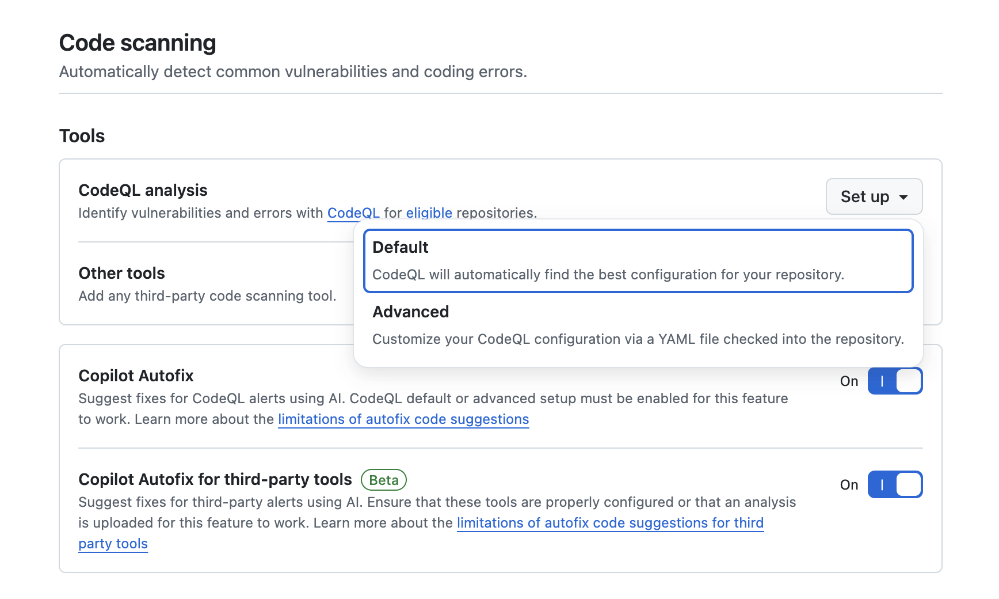

4. **Default** を選択（推奨）

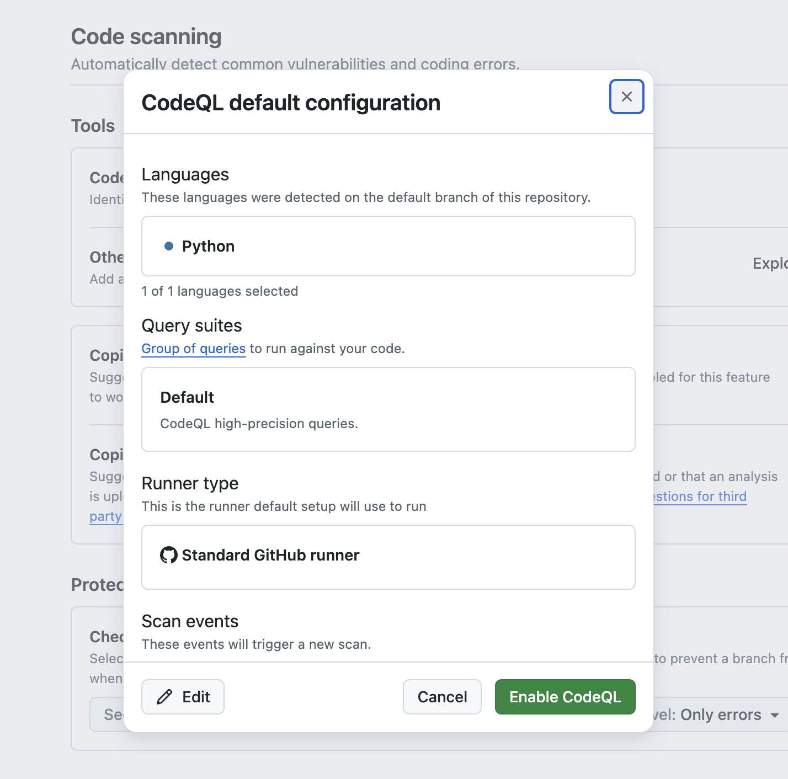

5. **Enable CodeQL** をクリック

これにより、プッシュ時やプルリクエスト作成時にコードの自動スキャンが実行されます。

### 3. Copilot 機能の確認

GitHubで利用可能なCopilot機能を確認しましょう。

1. GitHubの右上のプロフィールアイコンをクリック
2. **Your Copilot** を選択

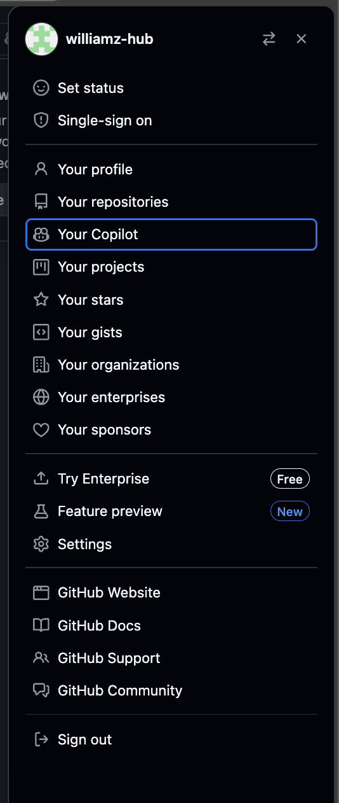

以下の機能が有効になっていることを確認してください：

- **Copilot in GitHub.com** - GitHubのWebサイト上でCopilotを使用
- **Copilot coding agent** - より高度なコーディング支援
- **MCP servers in Copilot** - Model Context Protocol サーバーの利用

> aside negative
>
> **プラン制限**: Copilot Code ReviewやCoding Agentなどの高度な機能は、GitHub Copilot Business/Enterprise プランでのみ利用可能です。Freeプランをご利用の場合、これらの機能は利用できません。

### 4. GitHub MCP Server のセットアップ

Model Context Protocol (MCP) サーバーを使用することで、Copilotの機能を拡張できます。

#### ステップ1: MCP サーバーの追加

1. VS Code でコマンドパレットを開く: `Ctrl+Shift+P` (Windows/Linux) / `Cmd+Shift+P` (Mac)
2. `mcp: add server` と入力して選択

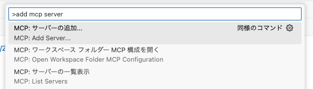

3. **HTTP** を選択
4. サーバーURL: `https://api.githubcopilot.com/mcp/` を入力
5. Server ID の入力欄で `github-mcp-server` と入力（または Enter でスキップ）
6. 保存先は **このワークスペースに保存** を選択
7. GitHub アカウントで認証を行う

#### ステップ2: MCP サーバーの起動確認

`.vscode/mcp.json` にMCPサーバーの設定が保存されます。

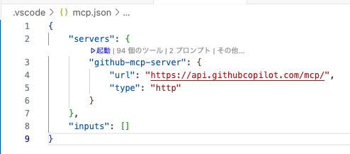

#### ステップ3: ツールの有効化

1. Copilot Chat でツールボタンをクリック

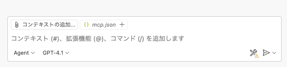

2. GitHub MCP サーバーがリストに表示されることを確認
3. チェックボックスにチェックを入れて有効化

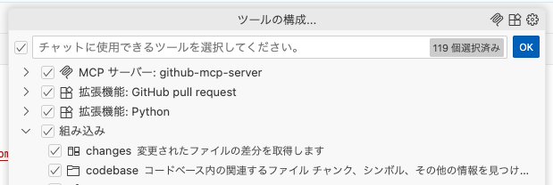

これで、GitHub の情報を直接 Copilot Chat で参照できるようになります。

> aside positive
>
> **ヒント**: MCP サーバーを使用すると、Copilot がリポジトリの情報、Issues、Pull Requests などに直接アクセスして、より詳細な回答や提案を行うことができます。

## ポモドーロタイマーを作ってみよう
Duration: 30

ここまでで、VS Code上で利用できるGitHub Copilotの基本的な使い方を学びました。次は、実際にアプリケーションを開発してみましょう。

今回のハンズオンでは、ポモドーロタイマーアプリケーションを開発します。このアプリケーションは、作業時間と休憩時間を設定し、タイマーを管理する機能を持っています。

以下のようなUIを持つアプリケーションを作成することを目指します。


では、まずVS Code上で、新しいPythonファイルを作成しましょう。今回はWebアプリケーションとして作成したいので、Flaskを使用します。メインファイル名は「app.py」としましょう。

### プロジェクトの概要

ポモドーロテクニック用のWebタイマーアプリケーションを作成します。

### 必要な機能
- 25分の作業タイマー
- 5分の休憩タイマー
- タイマーの開始・停止・リセット
- 進捗表示と統計機能
- ブラウザ通知とサウンド通知
- レスポンシブなWebUI

## ポモドーロタイマーの設計を考える
Duration: 10

まず、いきなり実装を始めるのではなく、どういった方針・設計で進めるかをCopilotに相談してみましょう。ここから先は、すべてエージェントモードで進めていきます。

今回のようにUIを持ったWebアプリケーションを作成するにあたって役に立つのが、Copilot Chatに画像をアップロードする機能です。これを使うことで、アプリケーションのUIイメージをCopilotに理解させることができます。

前ページのUIイメージをまずはプロジェクトのルートに `pomodoro.png` として保存してください。その後、チャット欄の `Add Context` をクリックし、「Image from Clipboard」または「Files & Folders...」を選択します。そして、UIイメージの画像を選択します。


画像のアップロードができたら、Copilot Chatに画像が表示されます。

その上で、次のプロンプトを入力してみましょう。

```
このプロジェクトでポモドーロタイマーのWebアプリを作成する予定です。添付の画像はそのアプリのUIモックです。FlaskとHTML/CSS/JavaScriptを使用してこのアプリを作成するにあたって、どのような設計で進めるべきか、アーキテクチャの提案をしてください。
```

すると、推奨のWebアプリケーションアーキテクチャを提案してくれます。

このアーキテクチャに対して、もっとこうした方が良いという点や考慮不足の点があれば、それを指摘してみましょう。例えば次のような指摘です。

```
ユニットテストのしやすさという点を考慮して、今のアーキテクチャにもし改善や追加が必要な点があればそれも書き出してください。
```

このやり取りを経て、アーキテクチャの設計が固まったら、一度その内容をファイルに保存してもらいましょう。そうすることで、別のチャットセッションを開いても、同じアーキテクチャの内容を参照することができます。

```
ここまでの会話でアーキテクチャについては固まったので、これまでの会話の内容を踏まえて、プロジェクトのルートにarchitecture.mdというファイルに、Webアプリケーションアーキテクチャ案をまとめてください。
```

> aside positive
>
> Copilot Chatでのやりとりに一区切りがついたら、新しい会話を始めることで、よりCopilotに対して明確な指示を与えることができます。新しい会話を始めるには、チャットウィンドウの上部にある「新しい会話」ボタンをクリックします。その際、今回のアーキテクチャの内容のように、今後のチャットでも参照したい内容は、今回のようにファイルに書き出して保存しておくと便利です。


## やることを洗い出そう
Duration: 10

ここまでで、UIモックとアーキテクチャの設計が固まりました。具体的にどのような機能を実装する必要があるかを検討していきましょう。これもCopilot Chatに相談してみます。その際、pomodoro.pngとarchitecture.mdを添付しましょう。

```
このポモドーロタイマーアプリケーションを作成するにあたって、実装する必要のある機能を洗い出してください。
```


この内容もCopilotとのチャットを通して、改善していきましょう。内容が固まったら、アーキテクチャの時と同様にこの内容もfeatures.mdというファイルにまとめて保存しておきましょう。

```
ありがとうございます。その内容で良さそうなので、実装する必要のある機能一覧をfeatures.mdというファイルに書いてください。
```

では、ここから実装を始めるわけですが、Copilotを使いこなすコツとしては、一度に大きな機能を実装しようとするのではなく、まずは小さな機能から実装していくことです。これにより、Copilotが提案するコードの精度が上がり、よりスムーズに開発を進めることができます。

今回のアプリケーション開発を、どのような粒度で細分化して実装していくかについても、Copilotに相談してみましょう。ここでは、pomodoro.png、architecture.md、features.mdを添付しましょう。

```
このポモドーロタイマーアプリケーションを段階的に実装していきたいと考えています。添付の画像とアーキテクチャ、機能一覧を踏まえて、どのような粒度で機能を実装していくべきか、段階的な実装計画を提案してください。
```

私が試したところ、6つのステップからなる計画を提案してくれました。この点についても、もっとこうしてほしいなどがあれば、Copilotに指摘してみましょう。そして、この内容も後で参照できるように、plan.mdというファイルにまとめて保存しておきましょう。その際、どういうプロンプトで指示するべきかは、みなさん自身で考えてみてください。

## 実装しよう
Duration: 30

ここまでの準備が整ったので、いよいよ実装に取り掛かりましょう。前のステップで提案された実装計画に従って、段階的に機能を実装していきます。

### プロジェクト構成の準備

まずは、今回のアーキテクチャに従ったプロジェクトのディレクトリ構成を作成しましょう。

まずは、`architecture.md` のようなアーキテクチャを実現するにあたって、現在のプロジェクトのフォルダ構成を修正してください。必要に応じてファイルの移動や、設定ファイルの変更も行ってください。

その後、`pomodoro.png`, `architecture.md`, `plan.md` を添付した上で、次のようにCopilotに指示を出してみましょう。

```
plan.mdのステップ１を実装してください。その際、すでにこのプロジェクトにあるファイルを別のディレクトリに移動する必要があれば、その作業も実行してください。もし追加で考慮が必要なことがあれば、私に質問してください。
```

すると、私のケースでは以下のように検討が必要な質問をしてきました。こういった場合には、必要な情報を提供しましょう。


その後、Copilotは、ステップ1の実装を行います。実装が完了したら、Copilotは自らの判断でプロジェクトのビルドを行い、エラーがないかを確認します。エラーが発生した場合は、そのエラーを解決するために追加で修正を行います。このような自律的な動作が、エージェントモードの特徴です。

実装が完了したら、以下の点を確認してみましょう：

1. **ディレクトリ構造**：推奨されたアーキテクチャに沿った構成になっているか
2. **基本ファイル**：必要な基本ファイル（app.py、HTML テンプレート、CSS ファイルなど）が作成されているか
3. **動作確認**：簡単な動作テストを行って、エラーが発生していないか


以下が、私の場合のステップ1の実装結果です。この段階でどのようなアプリケーションになっているかは人によって異なるでしょう。


## テストを書こう
Duration: 20

このまま実装を続ける前に、実装した機能に対してユニットテストを書いておきましょう。ユニットテストを書くことで、後のステップでの変更が既存の機能に影響を与えないことを確認できます。

もし前ページの段階でユニットテストも実装されている場合は、このページは読み飛ばしてください。

### テストの実装

次のようなプロンプトを実行してみましょう。

```
現在の実装に対して、ユニットテストが全くないので、ユニットテストを実装してください。
```

すると、Copilotエージェントはユニットテスト用の依存関係をインストールするために、コマンドを使って良いかどうかを尋ねてきます。このように、エージェントが何かのコマンドを実行する前には、必ずユーザーに確認を求めます。ここでは、必要なコマンドを実行することを許可するために、「Continue」をクリックします。


すると、CopilotはVS Code内のターミナル内で、先ほどのコマンドを実行し、必要な依存関係をインストールします。それ以降も同様に、Copilotが何かのコマンドを実行する前には、必ずユーザーに確認を求めます。もし、そのコマンドを実行してエラーが発生した場合は、そのエラーを解決するために、エージェントは追加の修正を行います。


## 残りの機能を実装しよう（オプション）
Duration: 20

このセクションは **オプション** です。基本的なCopilot機能を学習済みの方で、より高度な実装に挑戦したい場合に実施してください。

ここからは、自由課題として、残りの機能を段階的に実装していきましょう。

いくつか役に立つであろうポイントをここでは紹介します。

### UIに対して指示をしたい場合

UI上の特定の要素に対して指示を出したい場合は、UIのスクリーンショットをCopilotにアップロードすることで、その要素を認識させることができます。その際、スクリーンショットの上に特に指摘したい箇所を丸で囲むなり、矢印を引くなりして、どの要素に対して指示を出したいのかを明確にすると良いでしょう。

または、現状のスクリーンショットと、期待するスクリーンショットを2枚アップロードすることで、その差分を確認してもらい、期待するUIにできるだけ近づくように指示を出すこともできます。

### 毎回同じような指示を出している場合

プロンプトを書いたり、文脈を指定する際に、頻繁に同じような指示を出している場合は、Copilotにその指示を覚えさせることができます。具体的には、プロジェクト内に `.github/copilot-instructions.md` というファイルを作成し、その中に指示を書いておきます。このファイルがあると、Copilotはその指示を自動的に読み込み、以降のチャットでその指示を参照することができます。

以下にカスタム指示のサンプルを示します。

```markdown
このプロジェクトは、ポモドーロタイマーをFlaskで実装するものです。

以下はプロジェクトの重要なファイルです。ユーザーの指示に対して、必要に応じてこれらのファイルを参照してください。
 - `pomodoro.png`: アプリケーションのUIモックです。
 - `architecture.md`: アプリケーションのアーキテクチャドキュメントです。
 - `features.md`: 実装する機能の一覧です。
 - `plan.md`: 段階的な実装計画です。
```

そのほかにも、プロジェクトをビルドするコマンドやテストを実行するコマンドなど、プロジェクトに特有のコマンドを記載しておくと、Copilotはそのコマンドを自動的に使用するようになります。

### なかなか実装が進まなかったり、バグを解決できない場合

このような場合には、以下のアプローチを試してみましょう。

- デバッグ情報を出力するように指示し、その出力をCopilotに分析させる。
- 他のモデルを試してみる。

## GitにコミットしてPushしよう
Duration: 10

作成したコードをGitリポジトリにコミットしてリモートブランチにPushしましょう。ここでは3つの方法を紹介します。

### 方法A: ターミナルでコマンドを使用

従来の方法として、ターミナルでGitコマンドを直接実行する方法です：

```bash
git add .
git commit -m "ポモドーロタイマー機能を追加"
git push origin feature/pomodoro-timer
```

### 方法B: VS Code の Source Control を使用

VS Codeの統合されたGit機能を使用する方法です：

1. **VS Code の Source Control タブ**を開く
2. **変更されたファイル**の横にある **+** ボタンをクリックして、ステージングに追加
3. ✨ボタンをクリックして、Copilotにコミットメッセージを生成させる


4. **Commit** ボタン（青いボタン）をクリックしてリモートブランチにPush

### 方法C: MCP サーバーを使用（設定済みの方向け）

MCPサーバーを設定済みの方は、エージェントモードでCopilotに直接指示できます：

```
機能の作成が完了したので、コードの差分をgitのステージングにあげてください。

その後、適切なコミットメッセージでコミットいただき、リモートブランチに変更をPushしてください。
```


続いて、実装計画をGitHub Issuesとして管理していきます：

```
plan.mdの各ステップをGitHub issuesとして起票してください
```

この指示により、Copilotは以下を実行します：

1. `plan.md` の内容を読み取り
2. 各ステップを個別のIssueとして起票
3. 各Issueには以下が含まれます：
   - ステップのタイトルと詳細説明
   - 実装すべき機能の要件
   - 受け入れ条件
   - 適切なラベルと優先度

これにより、計画的なプロジェクト管理とアジャイル開発が可能になります。

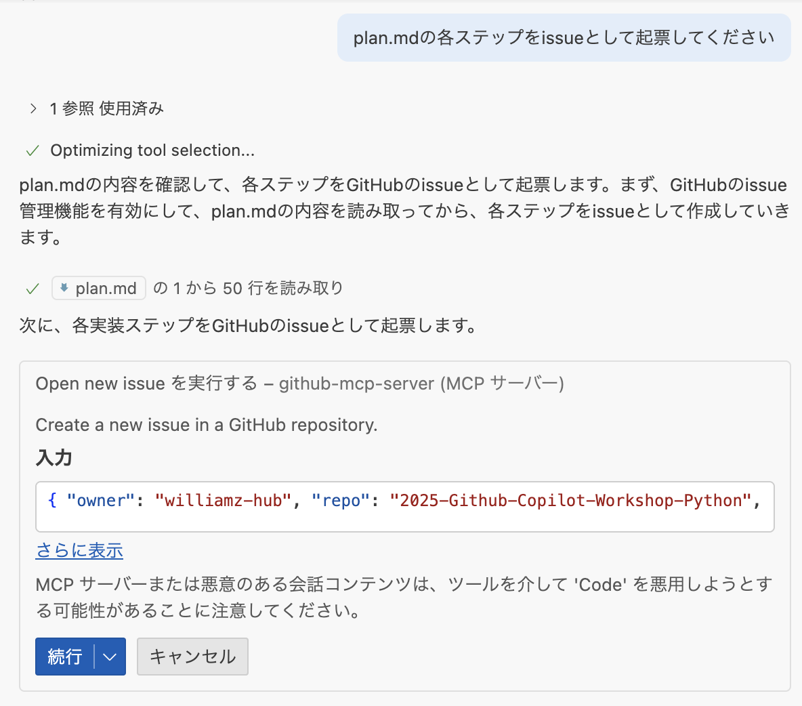

> aside positive
>
> **MCP の利点**: GitHub MCPサーバーを使用することで、Copilotがリポジトリの情報、Issues、Pull Requests、ブランチ情報などのGitHubメタデータに直接アクセスし、より詳細な分析や提案を行うことができます。


## GitHub.com上でのGitHub Copilot
Duration: 15

Pushした後の内容をGitHub.com上でPull Requestを立てて、Copilotのコードレビュー機能を活用しましょう。

### Pull Requestの作成とCopilot Summary

1. GitHub上でフォークしたリポジトリにアクセス
2. **Open a pull request** をクリック
3. Pull Request作成画面で、**Copilotのアイコン** >> **Summary** をクリック

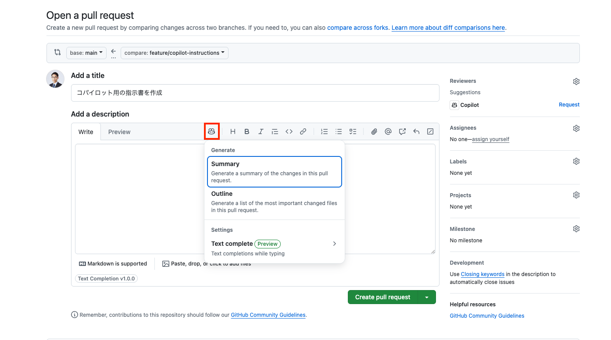

Copilotが自動的にPull Requestの概要を生成してくれます。

### Copilotをレビュワーとしてアサイン

**Reviewers** セクションで **Copilot** をアサインすることで、Copilotをレビュワーとしてアサインし、コードのレビューを依頼できます。

> aside positive
>
> **自動アサインの設定**: Settings >> Branches >> Rulesets >> Require a pull request before merging >> Automatically request Copilot code reviewにチェックを入れることで、Pull Requestを開いた時、自動的にCopilotがアサインされるようになります。

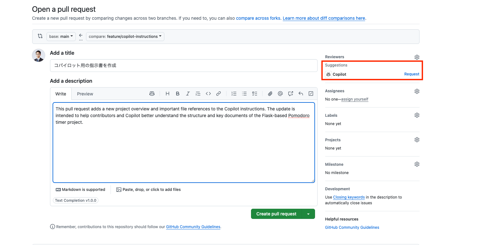

### Copilot Code Reviewの結果確認

Pull Requestが開かれた後、Copilot Code Reviewの結果を閲覧できます：

- **Pull Requestのオーバービュー**: コードの変更内容の要約
- **指摘事項**: 潜在的な問題点の指摘
- **改善提案**: コードの品質向上のための具体的な提案


### GitHub Advanced Securityによる静的脆弱性スキャン

Pull Requestには、GitHub Advanced Security（GHAS）による静的脆弱性スキャンの結果も表示されます：

#### セキュリティアラートの確認


- **高セキュリティ脆弱性**: 重要度の高いセキュリティ問題
- **Copilot Autofix**: AIによる自動修正提案
- **詳細な説明**: 脆弱性の内容と修正方法

#### チェック結果の詳細


> aside positive
>
> **Copilot Autofixの活用**: GitHubは検出されたセキュリティ脆弱性に対して、Copilot Autofixによる自動修正提案を提供します。これにより、セキュリティ問題を迅速に解決できます。

## Issueの自動起票とCoding Agent
Duration: 20

GitHub CopilotのWebサイト版を使用して、プロジェクトの改善提案をIssueとして自動生成し、Coding Agentを活用してみましょう。

### GitHub Copilotでのissue自動起票

1. **GitHub.com** にアクセスし、右上の **Copilot** アイコンをクリック
2. Chatのコンテキストに自身のリポジトリが追加されていることを確認
3. 以下のプロンプトを入力します：

```
ポモドーロタイマーのカスタマイズを行うために３つのissueを起票してください。

パターンA: 視覚的フィードバックの強化

円形プログレスバーのアニメーション: 残り時間に応じて滑らかに減少するアニメーション
色の変化: 時間経過に応じて青→黄→赤にグラデーション変化
背景エフェクト: 集中時間中は背景にパーティクルエフェクトや波紋アニメーション
テスト目的: 視覚的な没入感がユーザーの集中力に与える影響を測定

パターンB: カスタマイズ性の向上

時間設定の柔軟化: 25分固定ではなく、15/25/35/45分から選択可能
テーマ切り替え: ダーク/ライト/フォーカスモード（ミニマル）
サウンド設定: 開始音/終了音/tick音のオン/オフ切り替え
休憩時間カスタム: 5/10/15分から選択
テスト目的: 個人の好みに合わせた設定がユーザー継続率に与える影響を測定

パターンC: ゲーミフィケーション要素の追加

経験値システム: 完了したポモドーロに応じてXPとレベルアップ
達成バッジ: 「3日連続」「今週10回完了」などの実績システム
週間/月間統計: より詳細なグラフ表示（完了率、平均集中時間など）
ストリーク表示: 連続日数のカウント表示
テスト目的: ゲーミフィケーション要素がモチベーション維持と継続利用に与える影響を測定
```


### Issueの作成とCoding Agentのアサイン

1. **Copilotが3つのIssueを自動生成**します
2. 各Issueの内容を確認し、必要に応じて編集
3. **Create** ボタンをクリックして各Issueを作成
4. Issue画面に遷移後、**Assignees** セクションで **Copilot** を選択してCoding Agentをアサイン


### 期待されるPull Requestの結果

Coding Agentがアサインされると、以下のような結果が期待できます：

- **自動的なコード実装**: 各Issueの要件に基づいた機能実装
- **Pull Requestの作成**: 実装完了後の自動PR作成
- **包括的なテスト**: 単体テストとUIテストの両方を含む

#### パターンA: 視覚的フィードバックの強化


#### パターンB: カスタマイズ性の向上


#### パターンC: ゲーミフィケーション要素の追加


> aside positive
>
> **MCP Serverの活用**: GitHub MCP ServerとPlaywright MCP Serverが初期設定としてCoding Agentに含まれています。これにより、単体テストだけではなく、スクリーンショットによるUIの自動チェックも行うことができます。Coding Agentは実装した機能が期待通りに動作するかを視覚的に検証し、より品質の高いコードを提供します。

## おめでとうございます 🎉
Duration: 5

### 今日学んだこと

このワークショップでは以下のことを学びました：

- GitHub Copilotの基本的な使い方
- Copilot Chatでのコード解説・改善
- エージェント機能の活用
- 実際のアプリケーション開発でのCopilot活用

### 次のステップ

- 実際のプロジェクトでCopilotを活用してみる
- より複雑なアプリケーション開発に挑戦する
- Copilotの新機能をキャッチアップする

### リソース

- [GitHub Copilot Documentation](https://docs.github.com/copilot)
- [GitHub Copilot ベストプラクティス](https://docs.github.com/copilot/using-github-copilot/best-practices-for-using-github-copilot)

お疲れさまでした！