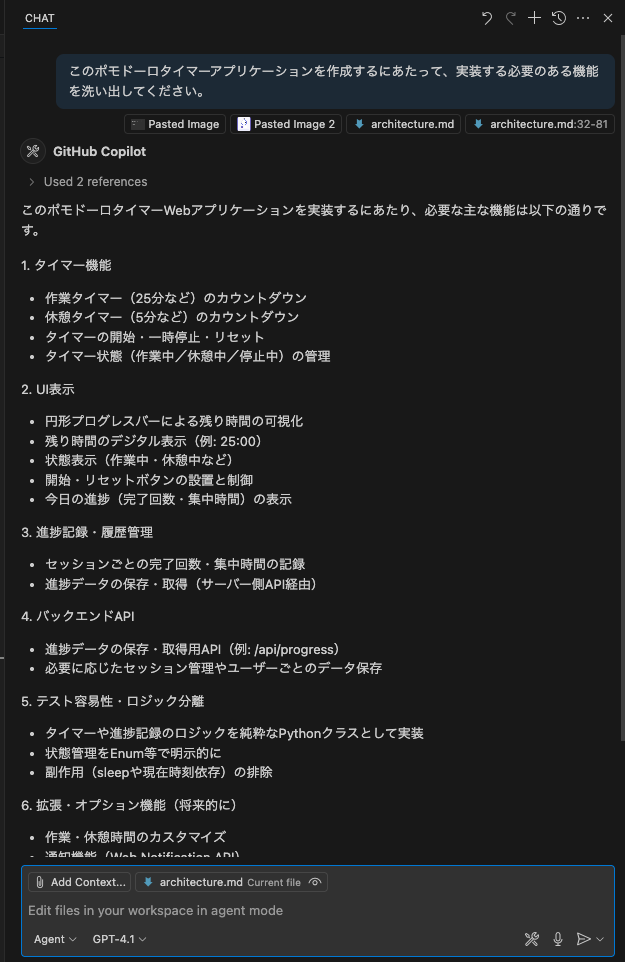
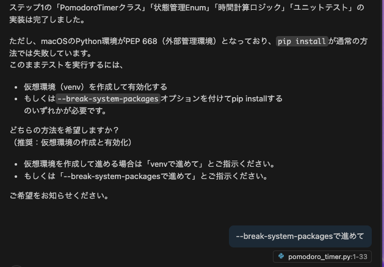
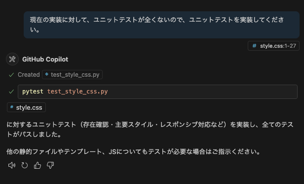

author: Your Name
summary: GitHub Copilot Workshop
id: github-copilot-workshop
categories: AI, Development
environments: Web
status: Published
feedback link: https://example.com/feedback

# GitHub Copilot Workshop

## About the Workshop
Duration: 5

Welcome to the GitHub Copilot Workshop! In this workshop, you will learn how to use GitHub Copilot to explain and improve code.
GitHub Copilot Chat enables interactive dialogue with AI through a chat experience. Let's learn how to use GitHub Copilot through this workshop!


### Today's Goals
- Understand the various features of GitHub Copilot
- Develop a new application using agent mode

### Prerequisites
- Visual Studio Code is installed
- GitHub Copilot license is available
- GitHub account is available

## Project Setup
Duration: 15

This workshop uses the following GitHub repository:

**Project URL**: https://github.com/moulongzhang/2025-Github-Copilot-Workshop-Python

### Step 1: Fork the Repository

First, open the project URL above in your browser and fork the repository:

1. Open the project URL (https://github.com/moulongzhang/2025-Github-Copilot-Workshop-Python) in your browser
2. Click the **Fork** button in the top right


3. Click the **Create fork** button on the fork creation screen


Once the fork is complete, a copy of the repository will be created in your GitHub account.

### Step 2: Development Environment Setup

You can start the project using your forked repository with either of the following methods:

#### Method A: Using GitHub Codespaces (Recommended)

1. On your forked repository page (`https://github.com/[your-username]/2025-Github-Copilot-Workshop-Python`)
2. Click the green **Code** button
3. Select the **Codespaces** tab
4. Click **Create codespace on main**


> aside positive
>
> **Tip**: Using Codespaces launches a VS Code-like environment in your browser, allowing you to start development immediately.


#### Method B: Clone to Local Environment

If you have VS Code installed locally:

1. Open Terminal or Command Prompt
2. Clone your forked repository with the following command:

```bash
git clone https://github.com/[your-username]/2025-Github-Copilot-Workshop-Python.git
```

3. Navigate to the cloned directory:

```bash
cd 2025-Github-Copilot-Workshop-Python
```

4. Open the project in VS Code:

```bash
code .
```

### Step 3: Install Required Extensions

After opening the project, please install the following extensions:

1. Install the **GitHub Copilot** extension
2. Install the **GitHub Copilot Chat** extension
3. Install the **Python** extension

### Step 4: Configuration Verification

1. Confirm that you have successfully signed in to your GitHub account in VS Code
2. Confirm that Copilot functionality is enabled
3. Confirm that the Python interpreter is correctly configured

## Try Using Code Completion
Duration: 10

Let's experience GitHub Copilot's basic code completion functionality.

### Install Copilot Extensions

1. Install the **GitHub Copilot** extension
2. Install the **GitHub Copilot Chat** extension

### Configuration Verification
Confirm that you have successfully signed in VS Code.

### Try Code Completion

Create a new Python file and enter the following comment:

```python
# Function to calculate Fibonacci sequence
def fibonacci(n):
```

Confirm that Copilot automatically suggests code for you.

> aside positive
>
> **Tip**: You can accept suggestions with the `Tab` key, and view the next suggestion with `Alt+]`.

## GitHub Copilot Next Edit Suggestions Activation Instructions
Duration: 10

### Overview
⚙️ [`github.copilot.nextEditSuggestions.enabled`](vscode://settings/github.copilot.nextEditSuggestions.enabled) is a setting that enables GitHub Copilot's next-generation edit suggestion feature. This feature allows you to receive more advanced code editing suggestions.

### 1. Open VS Code

### 2. Access Settings Screen
Open the settings screen using one of the following methods:

#### Method A: From Menu
- **Windows/Linux**: `File` → `Preferences` → `Settings`
- **macOS**: `Code` → `Settings...` → `Settings`

#### Method B: Keyboard Shortcut
- **Windows/Linux**: `Ctrl + ,`
- **macOS**: `Cmd + ,`

#### Method C: Command Palette
- `Ctrl + Shift + P` (Windows/Linux) or `Cmd + Shift + P` (macOS)
- Select `Preferences: Open Settings (UI)`

### 3. Search Settings
Enter the following in the settings search box:
```
github.copilot.nextEditSuggestions.enabled
```

### 4. Enable Setting
- Check the checkbox for the setting item shown in search results
- Or change `false` to `true`

### 5. Confirm Setting
Verify the setting is correctly applied:
- Restart VS Code (recommended)
- Edit code in the editor and confirm the new suggestion feature works

### Alternative Method: Direct Edit in settings.json

#### 1. Open settings.json file
- `Ctrl + Shift + P` (Windows/Linux) or `Cmd + Shift + P` (macOS)
- Select `Preferences: Open User Settings (JSON)`

#### 2. Add Setting
```json
{
    "github.copilot.nextEditSuggestions.enabled": true
}
```

#### 3. Save File
- `Ctrl + S` (Windows/Linux) or `Cmd + S` (macOS)

### Let's Try It Out

Please open the `point.py` file included in the project. This file contains a class representing points in two-dimensional space:

```python
import math

class Point2D:
    def __init__(self, x, y):
        self.x = x
        self.y = y
    
    def distance_to(self, other):
        dx = self.x - other.x
        dy = self.y - other.y
        return math.sqrt(dx * dx + dy * dy)
    
    def __str__(self):
        return f"Point2D({self.x}, {self.y})"
```

Now, we want to extend this class to represent points in three-dimensional space. First, let's manually change the class name to `Point3D`. GitHub Copilot will then suggest the next edit candidates.

> aside positive
>
> **Important**: It may take some time for Next Edit Suggestions to appear. Please be patient and wait.

The suggestions should show changes like the following:
- Adding the `z` parameter to the `__init__` method
- Adding `self.z = z`
- Extending the `distance_to` method to three-dimensional distance calculation
- Displaying z coordinates in the `__str__` method

In this state, pressing the `Tab` key will move the cursor to the location where GitHub Copilot is suggesting. To accept the suggestion, press the `Tab` key again.

GitHub Copilot should then suggest the next edit candidate. You can also accept this suggestion by pressing the `Tab` key. This way, you can efficiently edit code using Next Edit Suggestions.

### Let's Look at the Results

Let's continue working on extending the Point2D class to Point3D. You should be able to make all methods compatible with three-dimensional space.

Example of expected final code:

```python
import math

class Point3D:
    def __init__(self, x, y, z):
        self.x = x
        self.y = y
        self.z = z
    
    def distance_to(self, other):
        dx = self.x - other.x
        dy = self.y - other.y
        dz = self.z - other.z
        return math.sqrt(dx * dx + dy * dy + dz * dz)
    
    def __str__(self):
        return f"Point3D({self.x}, {self.y}, {self.z})"
```

### Let's Also Try with TODO Comments

Replace `二次元` (two-dimensional) with `三次元` (three-dimensional) in the commented first line.

```python
# Class representing points in three-dimensional space
class Point2D:
    def __init__(self, x, y):
        self.x = x
        self.y = y
    
    def distance_to(self, other):
        # TODO: Add distance calculation code here
        pass
    
    def __str__(self):
        # TODO: Return string representation
        pass
```

Place the cursor after the TODO comments and check Copilot's suggestions.

### Important Notes

- Make sure VS Code's GitHub Copilot extension is updated to the latest version
- Restarting VS Code is recommended after setting changes

### Troubleshooting

#### If Settings Are Not Found
1. Confirm GitHub Copilot extension is installed
2. Confirm extension is updated to the latest version
3. Restart VS Code and try again

#### If Functionality Doesn't Work
1. Confirm you are logged in to GitHub Copilot
2. Check internet connection
3. Check VS Code console for error messages

## Copilot Chat Hands-on Preparation
Duration: 5

### Create File

Please save the following file as `delivery_manager.py`.

```python
import time
import random
from typing import List, Callable, Optional
from dataclasses import dataclass, field
from enum import Enum


class EventArgs:
    """Base class for event arguments"""
    pass


class Event:
    """Class equivalent to C# event"""
    
    def __init__(self):
        self._handlers: List[Callable] = []
    
    def add_handler(self, handler: Callable):
        """Add event handler"""
        if handler not in self._handlers:
            self._handlers.append(handler)
    
    def remove_handler(self, handler: Callable):
        """Remove event handler"""
        if handler in self._handlers:
            self._handlers.remove(handler)
    
    def invoke(self, sender, args: EventArgs = None):
        """Fire event"""
        for handler in self._handlers:
            handler(sender, args or EventArgs())


@dataclass
class KitchenObjectSO:
    """Kitchen object data class"""
    name: str
    object_id: int


@dataclass
class RecipeSO:
    """Recipe data class"""
    name: str
    kitchen_object_so_list: List[KitchenObjectSO] = field(default_factory=list)


@dataclass
class RecipeListSO:
    """Recipe list data class"""
    recipe_so_list: List[RecipeSO] = field(default_factory=list)


class PlateKitchenObject:
    """Plate kitchen object"""
    
    def __init__(self):
        self._kitchen_object_so_list: List[KitchenObjectSO] = []
    
    def add_kitchen_object(self, kitchen_object: KitchenObjectSO):
        """Add kitchen object"""
        self._kitchen_object_so_list.append(kitchen_object)
    
    def get_kitchen_object_so_list(self) -> List[KitchenObjectSO]:
        """Get kitchen object list"""
        return self._kitchen_object_so_list.copy()


class KitchenGameManager:
    """Kitchen game manager (Singleton)"""
    
    _instance: Optional['KitchenGameManager'] = None
    
    def __init__(self):
        self._is_game_playing = False
    
    @classmethod
    def get_instance(cls) -> 'KitchenGameManager':
        """Get Singleton instance"""
        if cls._instance is None:
            cls._instance = cls()
        return cls._instance
    
    def is_game_playing(self) -> bool:
        """Check if game is in progress"""
        return self._is_game_playing
    
    def start_game(self):
        """Start game"""
        self._is_game_playing = True
    
    def stop_game(self):
        """Stop game"""
        self._is_game_playing = False


class DeliveryManager:
    """Delivery management class (Python version)"""
    
    _instance: Optional['DeliveryManager'] = None
    
    def __init__(self, recipe_list_so: RecipeListSO):
        # Event definitions
        self.on_recipe_spawned = Event()
        self.on_recipe_completed = Event()
        self.on_recipe_success = Event()
        self.on_recipe_failed = Event()
        
        # Private variables
        self._recipe_list_so = recipe_list_so
        self._waiting_recipe_so_list: List[RecipeSO] = []
        self._spawn_recipe_timer = 0.0
        self._spawn_recipe_timer_max = 4.0
        self._waiting_recipes_max = 4
        self._successful_recipes_amount = 0
        self._last_update_time = time.time()
    
    @classmethod
    def get_instance(cls, recipe_list_so: RecipeListSO = None) -> 'DeliveryManager':
        """Get Singleton instance"""
        if cls._instance is None:
            if recipe_list_so is None:
                raise ValueError("recipe_list_so is required for initial creation")
            cls._instance = cls(recipe_list_so)
        return cls._instance
    
    def update(self):
        """Frame update processing (Unity Update equivalent)"""
        current_time = time.time()
        delta_time = current_time - self._last_update_time
        self._last_update_time = current_time
        
        self._spawn_recipe_timer -= delta_time
        
        if self._spawn_recipe_timer <= 0.0:
            self._spawn_recipe_timer = self._spawn_recipe_timer_max
            
            kitchen_game_manager = KitchenGameManager.get_instance()
            if (kitchen_game_manager.is_game_playing() and 
                len(self._waiting_recipe_so_list) < self._waiting_recipes_max):
                
                # Randomly select recipe
                waiting_recipe_so = random.choice(self._recipe_list_so.recipe_so_list)
                self._waiting_recipe_so_list.append(waiting_recipe_so)
                
                # Fire event
                self.on_recipe_spawned.invoke(self)
    
    def deliver_recipe(self, plate_kitchen_object: PlateKitchenObject):
        """Check if recipe ingredients match plate ingredients"""
        
        for i, waiting_recipe_so in enumerate(self._waiting_recipe_so_list):
            plate_ingredients = plate_kitchen_object.get_kitchen_object_so_list()
            
            # Check if ingredient count matches
            if len(waiting_recipe_so.kitchen_object_so_list) == len(plate_ingredients):
                plate_contents_matches_recipe = True
                
                # Check each ingredient in recipe
                for recipe_kitchen_object_so in waiting_recipe_so.kitchen_object_so_list:
                    ingredient_found = False
                    
                    # Compare with plate ingredients
                    for plate_kitchen_object_so in plate_ingredients:
                        if plate_kitchen_object_so == recipe_kitchen_object_so:
                            ingredient_found = True
                            break
                    
                    if not ingredient_found:
                        plate_contents_matches_recipe = False
                        break
                
                # If ingredients match completely
                if plate_contents_matches_recipe:
                    self._successful_recipes_amount += 1
                    self._waiting_recipe_so_list.pop(i)
                    
                    # Fire success events
                    self.on_recipe_completed.invoke(self)
                    self.on_recipe_success.invoke(self)
                    return
        
        # If no matching recipe found
        self.on_recipe_failed.invoke(self)
    
    def get_waiting_recipe_so_list(self) -> List[RecipeSO]:
        """Get waiting recipe list"""
        return self._waiting_recipe_so_list.copy()
    
    def get_successful_recipes_amount(self) -> int:
        """Get number of successful recipes"""
        return self._successful_recipes_amount


# Usage example
if __name__ == "__main__":
    # Create sample data
    tomato = KitchenObjectSO("Tomato", 1)
    lettuce = KitchenObjectSO("Lettuce", 2)
    bread = KitchenObjectSO("Bread", 3)
    
    # Sample recipes
    sandwich_recipe = RecipeSO("Sandwich", [bread, lettuce, tomato])
    salad_recipe = RecipeSO("Salad", [lettuce, tomato])
    
    recipe_list = RecipeListSO([sandwich_recipe, salad_recipe])
    
    # Initialize game manager and delivery manager
    game_manager = KitchenGameManager.get_instance()
    game_manager.start_game()
    
    delivery_manager = DeliveryManager.get_instance(recipe_list)
    
    # Set up event handlers
    def on_recipe_spawned(sender, args):
        print("New recipe has been generated!")
    
    def on_recipe_success(sender, args):
        print("Recipe delivery success!")
    
    def on_recipe_failed(sender, args):
        print("Recipe delivery failed...")
    
    delivery_manager.on_recipe_spawned.add_handler(on_recipe_spawned)
    delivery_manager.on_recipe_success.add_handler(on_recipe_success)
    delivery_manager.on_recipe_failed.add_handler(on_recipe_failed)
    
    # Sample execution
    print("Game starting...")
    
    # Run update processing for 5 seconds
    start_time = time.time()
    while time.time() - start_time < 5:
        delivery_manager.update()
        time.sleep(0.1)  # Update every 100ms
    
    print(f"Number of waiting recipes: {len(delivery_manager.get_waiting_recipe_so_list())}")
    
    # Sample delivery test
    plate = PlateKitchenObject()
    plate.add_kitchen_object(bread)
    plate.add_kitchen_object(lettuce)
    plate.add_kitchen_object(tomato)
    
    print("Delivering sandwich...")
    delivery_manager.deliver_recipe(plate)
    
    print(f"Number of successful recipes: {delivery_manager.get_successful_recipes_amount()}")
```

## Explain the Code
Duration: 15

Let's have Copilot Chat explain this code.

### Open Copilot Chat

1. Click the **Chat** icon (chat bubble icon) in VS Code's sidebar to open Copilot Chat
2. Or open the Chat panel with `Ctrl+Alt+I` (macOS: `Ctrl+Cmd+I`)

### Check Chat Mode

Confirm the chat mode is set to "Question" (we'll introduce "Agent" mode later).

### Request File Explanation

1. Enter `#delivery_manager.py` in the chat field
2. Enter the prompt "Please explain this entire file."
3. Press Enter and Copilot Chat will explain the entire `delivery_manager.py` file

> aside positive
>
> **Tip**: By adding `#` before a filename, you can include that entire file as context.

## Ask About Code Improvement Areas
Duration: 15

### Exercise

Let's ask Copilot Chat about the problematic parts of this code.

### 1. Ask About Overall Class Issues

First, let's ask what problems this code has as a whole class.

Ask Copilot Chat:

```
Looking at this entire DeliveryManager class, what problems and improvement points are there? Please tell me from the perspectives of design patterns, code quality, and maintainability.
```

### 2. Focus on Specific Methods for Improvement Points

Then, focusing on the `deliver_recipe()` method, let's ask what methods there are to improve this method.

#### Steps:
1. Enter `#deliver_recipe` in the chat field
2. Code element candidates (functions, classes, variables, etc.) will be displayed
3. Select the `deliver_recipe` method
4. Enter the following question:

```
What are some ways to improve this deliver_recipe method? Please suggest from the perspectives of readability, performance, and error handling.
```

> aside positive
>
> **Tip**: By using `#`, you can ask pinpointed questions about specific code elements. This allows you to get more specific and useful improvement suggestions.

### Code Review Function

To improve the current code, ask Copilot Chat the following:

```
Please improve this Python code. I'd like suggestions from the perspectives of performance, readability, and error handling.
```

### Check from Security Perspective

```
Are there any security issues with this code?
```

### Check Best Practices

```
Please check if this follows Python best practices.
```

## Try Using Agent Mode
Duration: 10

So far we've been using Copilot Chat in "Question" mode, but now let's try "Agent" mode. Agents can understand user intent and execute tasks more autonomously. Through practical examples, we'll learn how agents function.

### Switch to Agent Mode

First, with the `delivery_manager.py` file open, select "Agent" from the mode selection in Copilot Chat.

<div align="center">
  
  
  <div style="height: 24;"></div>
  
  
</div>

### Identify Issues

Then, enter the following prompt:

```
Please list the issues that exist in the DeliveryManager class. Then, present improvement proposals to solve each of these issues.
```


This should suggest multiple improvement points.

### Try with Different Models

By trying the same question with different models, you can compare the characteristics of each model.


### Implement Improvement Proposals

Now, let's have the suggested improvement proposals actually implemented.

```
Please implement all the improvement proposals you presented.
```

Copilot will then make direct code changes to the code open in the editor. However, this is still at the proposal stage, and the user decides whether to accept these changes. You can accept or reject by clicking the "Keep" or "Undo" buttons above the chat field.

### Agent Autonomy

Here, let's check the comments the agent returned. The agent didn't just change the code according to instructions, but may have confirmed that errors occurred after changing the code and tried to fix those errors as well. In an appropriate environment, the agent automatically detects errors that occur after code changes and attempts to fix them. This way, agents can understand user intent and execute tasks more autonomously.

### Command Execution Confirmation

When using agent mode, Copilot may ask whether it's okay to execute commands. This is because Copilot always asks for user confirmation before executing any command. Check the command content, and if there's no problem executing it, click "Allow this time". This allows Copilot to execute that command and make necessary changes.

> aside positive
>
> **Important**: In agent mode, Copilot operates more autonomously, so make sure to carefully review the proposed changes before accepting them.

## Settings for Next Task (Optional)
Duration: 20

This section is **optional**. If you want to try more advanced features after learning the basic functions of GitHub Copilot, please do this section.

### 1. Branch Preparation

#### Step 1: Reset Staged Changes

Return all changes currently in the staging area to the working directory:

```bash
git restore .
```

#### Step 2: Create New Branch

Create and switch to the feature/pomodoro branch:

```bash
git checkout -b feature/pomodoro
```

### 2. GitHub Advanced Security (GHAS) Setup

By enabling GitHub Advanced Security's Code Scanning feature, you can automatically detect code vulnerabilities.

1. Click the **Settings** tab of your forked repository
2. Select **Security** → **Code security** from the left sidebar
3. Click **Set up** in the **Code scanning** section


4. Select **Default** (recommended)


5. Click **Enable CodeQL**

This will execute automatic code scanning when pushing or creating pull requests.

### 3. Verify Copilot Features

Let's check the Copilot features available on GitHub.

1. Click the profile icon in the top right of GitHub
2. Select **Your Copilot**


Confirm that the following features are enabled:

- **Copilot in GitHub.com** - Use Copilot on GitHub's website
- **Copilot coding agent** - More advanced coding assistance
- **MCP servers in Copilot** - Use Model Context Protocol servers

> aside negative
>
> **Plan Limitations**: Advanced features like Copilot Code Review and Coding Agent are only available with GitHub Copilot Business/Enterprise plans. If you're using the Free plan, these features are not available.

### 4. GitHub MCP Server Setup

By using Model Context Protocol (MCP) servers, you can extend Copilot's functionality.

#### Step 1: Add MCP Server

1. Open Command Palette in VS Code: `Ctrl+Shift+P` (Windows/Linux) / `Cmd+Shift+P` (Mac)
2. Type and select `mcp: add server`


3. Select **HTTP**
4. Enter server URL: `https://api.githubcopilot.com/mcp/`
5. Enter `github-mcp-server` in the Server ID field (or press Enter to skip)
6. Select **Save to this workspace**
7. Authenticate with your GitHub account

#### Step 2: Verify MCP Server Startup

MCP server settings are saved in `.vscode/mcp.json`.


#### Step 3: Enable Tools

1. Click the tools button in Copilot Chat


2. Confirm that GitHub MCP server appears in the list
3. Check the checkbox to enable it


Now you can directly reference GitHub information in Copilot Chat.

> aside positive
>
> **Tip**: Using MCP servers allows Copilot to directly access repository information, Issues, Pull Requests, etc., enabling more detailed responses and suggestions.

## Let's Create a Pomodoro Timer
Duration: 30

So far, we've learned the basic usage of GitHub Copilot available in VS Code. Next, let's actually develop an application.

In this hands-on session, we'll develop a Pomodoro timer application. This application has functionality to set work time and break time, and manage timers.

We aim to create an application with a UI like the following:


First, let's create a new Python file in VS Code. Since we want to create it as a web application, we'll use Flask. Let's name the main file "app.py".

### Project Overview

We'll create a web timer application for the Pomodoro Technique.

### Required Features
- 25-minute work timer
- 5-minute break timer
- Timer start/stop/reset
- Progress display and statistics functionality
- Browser notifications and sound notifications
- Responsive web UI

## Think About Pomodoro Timer Design
Duration: 10

First, instead of jumping straight into implementation, let's consult with Copilot about what approach and design to proceed with. From here on, we'll proceed entirely in agent mode.

When creating web applications with UIs like this one, what's useful is Copilot Chat's image upload functionality. Using this, you can make Copilot understand your application's UI image.

First, save the UI image from the previous page as `pomodoro.png` in the project root. Then, click `Add Context` in the chat field and select either "Image from Clipboard" or "Files & Folders...". Then select the UI image.


Once the image is uploaded, the image will be displayed in Copilot Chat.

Then, try entering the following prompt:

```
We plan to create a Pomodoro timer web app in this project. The attached image is a UI mock of that app. For creating this app using Flask and HTML/CSS/JavaScript, what design approach should we take? Please propose an architecture.
```

This will suggest a recommended web application architecture.

If there are points you think could be improved or areas that lack consideration for this architecture, try pointing them out. For example, the following type of feedback:

```
Considering ease of unit testing, please also list any improvements or additions needed to the current architecture.
```

After this exchange, once the architecture design is finalized, let's save the content to a file. This way, even if you open a different chat session, you can reference the same architecture content.

```
Now that the architecture has been decided through our conversation, please create a file called architecture.md in the project root summarizing the web application architecture proposal based on our conversation so far.
```

> aside positive
>
> When you reach a break in your conversation with Copilot Chat, starting a new conversation allows you to give clearer instructions to Copilot. To start a new conversation, click the "New conversation" button at the top of the chat window. In such cases, content you want to reference in future chats, like this architecture content, should be written to files and saved as we did this time.


## Let's List What Needs to Be Done
Duration: 10

Now we have the UI mock and architecture design finalized. Let's examine what specific functionality needs to be implemented. We'll also consult with Copilot Chat about this. When doing so, let's attach pomodoro.png and architecture.md.

```
For creating this Pomodoro timer application, please list the functionality that needs to be implemented.
```




Let's also improve this content through chat with Copilot. Once the content is finalized, let's save this content to a file called features.md just like we did with the architecture.

```
Thank you. That looks good, so please write the list of functionality that needs to be implemented to a file called features.md.
```

Now we're about to start implementation, but a tip for mastering Copilot is not to try to implement large functions all at once, but to start implementing small functions first. This improves the accuracy of the code Copilot suggests and allows for smoother development progress.

Let's also consult with Copilot about what granularity to break down and implement this application development. Here, let's attach pomodoro.png, architecture.md, and features.md.

```
I want to implement this Pomodoro timer application step by step. Based on the attached image, architecture, and feature list, please suggest what granularity should be used to implement functions and propose a step-by-step implementation plan.
```

When I tried it, it suggested a plan consisting of 6 steps. If there are points you'd like to see improved, try pointing them out to Copilot. And let's save this content in a file called plan.md so it can be referenced later. Please think for yourself what prompt should be used to give instructions.

## Let's Implement
Duration: 30

Now that we've completed the preparation, let's finally start implementation. Following the implementation plan proposed in the previous step, we'll implement functions step by step.

### Project Structure Preparation

First, let's create a project directory structure that follows this architecture.

First, please modify the current project folder structure to realize an architecture like `architecture.md`. Move files and change configuration files as necessary.

Then, with `pomodoro.png`, `architecture.md`, and `plan.md` attached, let's give Copilot instructions like this:

```
Please implement step 1 of plan.md. If there are files that already exist in this project that need to be moved to other directories, please perform that work as well. If there are additional considerations needed, please ask me questions.
```

In my case, it asked questions that needed consideration as shown below. In such cases, provide the necessary information.



After that, Copilot implements step 1. Once implementation is complete, Copilot will build the project at its own discretion and check for errors. If errors occur, it will make additional fixes to resolve those errors. This autonomous behavior is characteristic of agent mode.

Once implementation is complete, let's check the following points:

1. **Directory Structure**: Is the configuration aligned with the recommended architecture?
2. **Basic Files**: Are the necessary basic files (app.py, HTML templates, CSS files, etc.) created?
3. **Operation Check**: Perform simple operation tests to see if any errors occur


Here is the result of my step 1 implementation. What kind of application it becomes at this stage will vary from person to person.


## Let's Write Tests
Duration: 20

Before continuing with implementation, let's write unit tests for the implemented functionality. By writing unit tests, we can ensure that changes in later steps don't affect existing functionality.

If unit tests were already implemented in the previous page's stage, you can skip this page.

### Test Implementation

Try executing a prompt like this:

```
There are no unit tests at all for the current implementation, so please implement unit tests.
```

Copilot Agent will then ask if it's okay to use commands to install dependencies for unit testing. Like this, agents always ask for user confirmation before executing any command. Here, click "Continue" to allow execution of necessary commands.



Copilot will then execute the command in VS Code's terminal and install necessary dependencies. Similarly after that, Copilot always asks for user confirmation before executing any command. If executing that command causes an error, the agent will make additional fixes to resolve that error.


## Let's Implement the Remaining Features (Optional)
Duration: 20

This section is **optional**. Please do this if you've already learned basic Copilot features and want to challenge more advanced implementation.

From here, let's implement the remaining features step by step as a free assignment.

Here we'll introduce some potentially useful points.

### When You Want to Give Instructions for UI

When you want to give instructions for specific elements on the UI, you can upload a screenshot of the UI to Copilot to make it recognize those elements. When doing so, it's good to clearly indicate which element you want to give instructions for by circling the specific areas you want to point out on the screenshot or drawing arrows to them.

Alternatively, you can upload two screenshots - one of the current state and one of the expected state - to have Copilot check the differences and give instructions to get as close as possible to the expected UI.

### When You're Giving Similar Instructions Repeatedly

When writing prompts or specifying context, if you're frequently giving similar instructions, you can have Copilot remember those instructions. Specifically, create a file called `.github/copilot-instructions.md` in your project and write instructions in it. When this file exists, Copilot automatically loads those instructions and can reference them in subsequent chats.

Below is a sample of custom instructions.

```markdown
This project implements a Pomodoro timer with Flask.

The following are important files in the project. Please reference these files as needed for user instructions.
 - `pomodoro.png`: This is the UI mock of the application.
 - `architecture.md`: This is the application architecture document.
 - `features.md`: This is the list of functions to implement.
 - `plan.md`: This is the step-by-step implementation plan.
```

Additionally, by recording project-specific commands such as commands to build the project or execute tests, Copilot will automatically use those commands.

### When Implementation Isn't Progressing Well or You Can't Resolve Bugs

In such cases, try the following approaches:

- Instruct to output debug information and have Copilot analyze that output.
- Try other models.

## Let's Commit to Git and Push
Duration: 10

Let's commit the created code to the Git repository and push it to a remote branch. Here we'll introduce three methods.

### Method A: Using Commands in Terminal

The traditional method of directly executing Git commands in the terminal:

```bash
git add .
git commit -m "Add Pomodoro timer functionality"
git push origin feature/pomodoro-timer
```

### Method B: Using VS Code's Source Control

Using VS Code's integrated Git functionality:

1. Open **VS Code's Source Control tab**
2. Click the **+** button next to **changed files** to add to staging
3. Click the ✨ button to have Copilot generate a commit message


4. Click the **Commit** button (blue button) to push to remote branch

### Method C: Using MCP Server (For Those Who Have Set It Up)

For those who have set up MCP server, you can give direct instructions to Copilot in agent mode:

```
Function creation is complete, so please add the code differences to git staging.

Then please commit with an appropriate commit message and push changes to the remote branch.
```


Next, we'll manage the implementation plan as GitHub Issues:

```
Please create GitHub issues for each step in plan.md
```

With this instruction, Copilot will:

1. Read the contents of `plan.md`
2. Create each step as an individual Issue
3. Each Issue will include:
   - Step title and detailed description
   - Requirements for functionality to implement
   - Acceptance criteria
   - Appropriate labels and priority

This enables planned project management and agile development.


> aside positive
>
> **MCP Benefits**: By using the GitHub MCP server, Copilot can directly access GitHub metadata such as repository information, Issues, Pull Requests, branch information, etc., enabling more detailed analysis and suggestions.


## GitHub Copilot on GitHub.com
Duration: 15

After pushing, let's create a Pull Request on GitHub.com for the pushed content and utilize Copilot's code review functionality.

### Creating Pull Request and Copilot Summary

1. Access your forked repository on GitHub
2. Click **Open a pull request**
3. On the Pull Request creation screen, click **Copilot icon** >> **Summary**


Copilot will automatically generate a summary of the Pull Request.

### Assign Copilot as Reviewer

In the **Reviewers** section, you can assign **Copilot** as a reviewer to request code review from Copilot.

> aside positive
>
> **Auto-assign Settings**: By checking Settings >> Branches >> Rulesets >> Require a pull request before merging >> Automatically request Copilot code review, Copilot will be automatically assigned when you open a Pull Request.


### Check Copilot Code Review Results

After the Pull Request is opened, you can view the results of Copilot Code Review:

- **Pull Request Overview**: Summary of code changes
- **Issues**: Identification of potential problems
- **Improvement Suggestions**: Specific suggestions for improving code quality


### Static Vulnerability Scanning with GitHub Advanced Security

Pull Requests also display results from static vulnerability scanning by GitHub Advanced Security (GHAS):

#### Check Security Alerts


- **High Security Vulnerabilities**: High-priority security issues
- **Copilot Autofix**: AI-powered automatic fix suggestions
- **Detailed Descriptions**: Content of vulnerabilities and how to fix them

#### Check Results Details


> aside positive
>
> **Utilizing Copilot Autofix**: GitHub provides automatic fix suggestions through Copilot Autofix for detected security vulnerabilities. This allows you to quickly resolve security issues.

## Automatic Issue Creation and Coding Agent
Duration: 20

Let's use the web version of GitHub Copilot to automatically generate project improvement suggestions as Issues and utilize Coding Agent.

### Automatic Issue Creation with GitHub Copilot

1. Access **GitHub.com** and click the **Copilot** icon in the top right
2. Confirm that your repository is added to the Chat context
3. Enter the following prompt:

```
Please create 3 issues for customizing the Pomodoro timer.

Pattern A: Enhanced Visual Feedback

Circular progress bar animation: Smooth decreasing animation based on remaining time
Color changes: Gradient changes from blue→yellow→red as time progresses
Background effects: Particle effects or ripple animations in the background during focus time
Test purpose: Measure the impact of visual immersion on user concentration

Pattern B: Improved Customization

Flexible time settings: Selectable from 15/25/35/45 minutes instead of fixed 25 minutes
Theme switching: Dark/Light/Focus mode (minimal)
Sound settings: On/off toggle for start/end/tick sounds
Custom break time: Choose from 5/10/15 minutes
Test purpose: Measure the impact of personalized settings on user retention rates

Pattern C: Addition of Gamification Elements

Experience point system: XP and level up based on completed Pomodoros
Achievement badges: Achievement system like "3 consecutive days", "10 completions this week"
Weekly/monthly statistics: More detailed graph displays (completion rate, average focus time, etc.)
Streak display: Display consecutive day count
Test purpose: Measure the impact of gamification elements on motivation maintenance and continued use
```


### Issue Creation and Coding Agent Assignment

1. **Copilot automatically generates 3 Issues**
2. Review the content of each Issue and edit as necessary
3. Click the **Create** button to create each Issue
4. After navigating to the Issue screen, select **Copilot** in the **Assignees** section to assign Coding Agent


### Expected Pull Request Results

When Coding Agent is assigned, you can expect the following results:

- **Automatic Code Implementation**: Feature implementation based on each Issue's requirements
- **Pull Request Creation**: Automatic PR creation after implementation completion
- **Comprehensive Testing**: Including both unit tests and UI tests

#### Pattern A: Enhanced Visual Feedback


#### Pattern B: Improved Customization


#### Pattern C: Addition of Gamification Elements


> aside positive
>
> **Utilizing MCP Server**: GitHub MCP Server and Playwright MCP Server are included as default settings in Coding Agent. This allows not only unit testing but also automatic UI checking through screenshots. Coding Agent visually verifies whether implemented features work as expected and provides higher quality code.

## Congratulations 🎉
Duration: 5

### What We Learned Today

In this workshop, we learned the following:

- Basic usage of GitHub Copilot
- Code explanation and improvement with Copilot Chat
- Utilizing agent functionality
- Leveraging Copilot in actual application development

### Next Steps

- Try using Copilot in actual projects
- Challenge more complex application development
- Keep up with new Copilot features

### Resources

- [GitHub Copilot Documentation](https://docs.github.com/copilot)
- [GitHub Copilot Best Practices](https://docs.github.com/copilot/using-github-copilot/best-practices-for-using-github-copilot)

Great work!